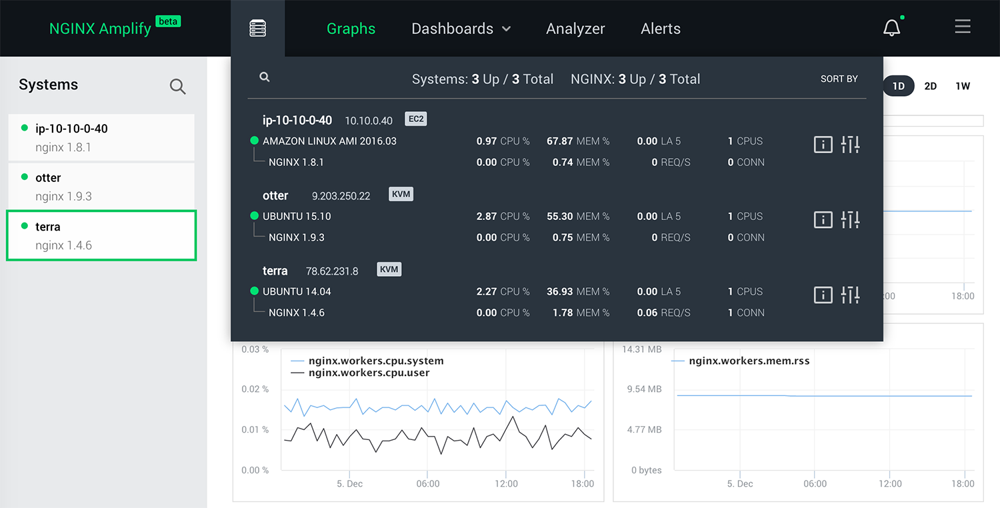
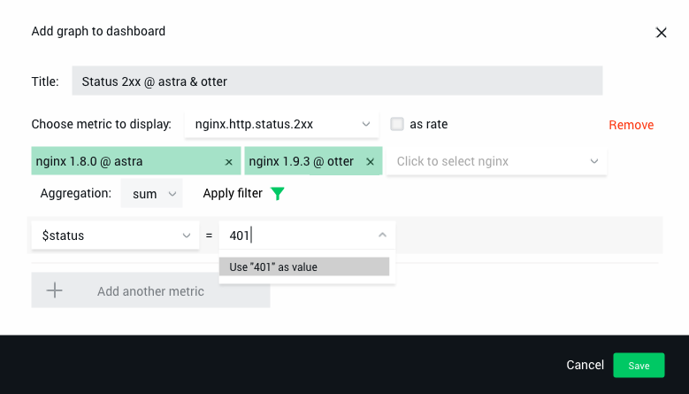

<!-- START doctoc generated TOC please keep comment here to allow auto update -->
<!-- DON'T EDIT THIS SECTION, INSTEAD RE-RUN doctoc TO UPDATE -->


- [Overview](#overview)
  - [What Is NGINX Amplify?](#what-is-nginx-amplify)
  - [Main Components](#main-components)
- [Installing and Managing NGINX Amplify Agent](#installing-and-managing-nginx-amplify-agent)
  - [Installing Amplify Agent](#installing-amplify-agent)
    - [Using the Install Script](#using-the-install-script)
    - [Installing Amplify Agent Manually](#installing-amplify-agent-manually)
      - [Installing on Ubuntu or Debian](#installing-on-ubuntu-or-debian)
      - [Installing on CentOS, Red Hat Linux, or Amazon Linux](#installing-on-centos-red-hat-linux-or-amazon-linux)
      - [Creating the Config File from a Template](#creating-the-config-file-from-a-template)
      - [Starting and Stopping Amplify Agent](#starting-and-stopping-amplify-agent)
      - [Verifying that Amplify Agent Has Started](#verifying-that-amplify-agent-has-started)
  - [Updating Amplify Agent](#updating-amplify-agent)
  - [Configuring Amplify Agent](#configuring-amplify-agent)
    - [Overriding the Effective User ID](#overriding-the-effective-user-id)
    - [Changing the API Key](#changing-the-api-key)
    - [Changing the Hostname and UUID](#changing-the-hostname-and-uuid)
    - [Setting Up a Proxy](#setting-up-a-proxy)
    - [Logging](#logging)
    - [Configuring the URL for stub_status or Extended Status](#configuring-the-url-for-stub_status-or-extended-status)
  - [How Amplify Agent Works](#how-amplify-agent-works)
  - [Metadata and Metrics Collection](#metadata-and-metrics-collection)
  - [Detecting and Monitoring NGINX Instances](#detecting-and-monitoring-nginx-instances)
  - [Configuring NGINX for Amplify Metric Collection](#configuring-nginx-for-amplify-metric-collection)
  - [NGINX Configuration Reports](#nginx-configuration-reports)
  - [What to Check if Amplify Agent Isn't Reporting Metrics](#what-to-check-if-amplify-agent-isnt-reporting-metrics)
  - [Amplify Agent Source Code](#amplify-agent-source-code)
- [User Interface](#user-interface)
  - [Graphs Page](#graphs-page)
    - [Systems List](#systems-list)
    - [Preview](#preview)
    - [Graph Feed](#graph-feed)
  - [Dashboards](#dashboards)
  - [Reports](#reports)
  - [Alerts](#alerts)
  - [Settings](#settings)
- [Metrics and Metadata](#metrics-and-metadata)
  - [OS Metrics](#os-metrics)
  - [NGINX Metrics](#nginx-metrics)
    - [HTTP Connections and Requests](#http-connections-and-requests)
    - [HTTP Methods](#http-methods)
    - [HTTP Status Codes](#http-status-codes)
    - [HTTP Protocol Versions](#http-protocol-versions)
    - [NGINX Process Metrics](#nginx-process-metrics)
    - [Additional NGINX Metrics](#additional-nginx-metrics)
      - [Upstream Metrics](#upstream-metrics)
      - [Cache Metrics](#cache-metrics)
    - [NGINX Plus Metrics](#nginx-plus-metrics)
      - [Server Zone Metrics](#server-zone-metrics)
      - [Upstream Zone Metrics](#upstream-zone-metrics)
      - [Cache Zone Metrics](#cache-zone-metrics)

<!-- END doctoc generated TOC please keep comment here to allow auto update -->


## Overview

### What Is NGINX Amplify?

NGINX Amplify is a tool for comprehensive NGINX monitoring. With Amplify it becomes possible to proactively analyze and fix problems related to running and scaling NGINX-based web application architectures.

You can use NGINX Amplify to do the following:

 * Visualize and identify NGINX performance bottlenecks, overloaded servers, or potential DDoS attacks
 * Improve and optimize NGINX performance with intelligent advice and recommendations
 * Get notified when something is wrong with application delivery
 * Plan web application capacity and performance
 * Keep track of the systems running NGINX

### Main Components

NGINX Amplify is a SaaS product, and it's hosted on AWS public cloud. It includes the following key components:

 * **Amplify Agent**

    A Python application that runs on monitored systems. Its role is to collect various metrics from the operating system and from the NGINX instances, then aggregate and send them to the backend system for visualization.

    All communications between the agent and NGINX Amplify SaaS are done securely over SSL/TLS. All traffic is always initiated by the agent.

 * **NGINX Amplify UI**

    The user interface accessible from all major browsers. The web interface is accessible only via TLS/SSL.

 * **Backend** (implemented as a SaaS)

    The core system component, implemented as a SaaS. It encompasses scalable metrics collection infrastructure, a database, and the core API.


## Installing and Managing NGINX Amplify Agent

### Installing Amplify Agent

In order to be able to use NGINX Amplify to monitor your infrastructure, you need to install Amplify Agent on each system that has to be checked.

**Note.** Amplify Agent will drop *root* privileges on startup. It will then use the user ID of the user `nginx` to set its effective user ID. The package install procedure will add the `nginx` user automatically unless it's already found in the system. If the [user](http://nginx.org/en/docs/ngx_core_module.html#user) directive appears in the NGINX configuration, the agent will pick up the user specified in the NGINX config for its effective user ID (e.g. `www-data`).

#### Using the Install Script

The installation procedure can be as simple as this.

 1. Download and run the install script.

        # curl -sS -L -O \
        https://github.com/nginxinc/nginx-amplify-agent/raw/master/packages/install.sh && \
        API_KEY='ecfdee2e010899135c258d741a6effc7' sh ./install.sh

    where API_KEY is a unique API key assigned to your Amplify account. You will see your API key when adding a new system in the Amplify web interface. You can also find the API key in the **Account Information** menu.

 2. Verify that Amplify Agent has started.

        # ps ax | grep -i 'amplify\-'
        2552 ?        S      0:00 amplify-agent

#### Installing Amplify Agent Manually

##### Installing on Ubuntu or Debian

 * Add the NGINX public key.

```
    # curl -fs http://nginx.org/keys/nginx_signing.key | apt-key add -
```

   or

```
    # wget -q -O - \
    http://nginx.org/keys/nginx_signing.key | apt-key add -
```

 * Configure the repository as follows.

```
    # codename=`lsb_release -cs` && \
    os=`lsb_release -is | tr '[:upper:]' '[:lower:]'` && \
    echo "deb http://packages.amplify.nginx.com/${os}/ ${codename} amplify-agent" > \
    /etc/apt/sources.list.d/nginx-amplify.list
```

 * Verify the repository config file (Ubuntu 14.04 example follows).

```
    # cat /etc/apt/sources.list.d/nginx-amplify.list
    deb http://packages.amplify.nginx.com/ubuntu/ trusty amplify-agent
```

 * Update the package index files.

```
    # apt-get update
```

 * Install and run Amplify Agent.

```
    # apt-get install nginx-amplify-agent
```

##### Installing on CentOS, Red Hat Linux, or Amazon Linux

 * Add the NGINX public key.

```
    # curl -sS -L -O http://nginx.org/keys/nginx_signing.key && \
    rpm --import nginx_signing.key
```

   or

```
    # wget -q -O nginx_signing.key http://nginx.org/keys/nginx_signing.key && \
    rpm --import nginx_signing.key
```

 * Create the repository config as follows (mind the correct release number).

   Use the first snippet below for CentOS and Red Hat Linux. The second one applies to Amazon Linux.

```
    # release="7" && \
    printf "[nginx-amplify]\nname=nginx amplify repo\nbaseurl=http://packages.amplify.nginx.com/centos/${release}/\$basearch\ngpgcheck=1\nenabled=1\n" > \
    /etc/yum.repos.d/nginx-amplify.repo
```

```
    # release="latest" && \
    printf "[nginx-amplify]\nname=nginx amplify repo\nbaseurl=http://packages.amplify.nginx.com/amzn/${release}/\$basearch\ngpgcheck=1\nenabled=1\n" > \
    /etc/yum.repos.d/nginx-amplify.repo
```

 * Verify the repository config file (RHEL 7.1 example follows).

```
    # cat /etc/yum.repos.d/nginx-amplify.repo 
    [nginx-amplify]
    name=nginx repo
    baseurl=http://packages.amplify.nginx.com/centos/7/$basearch
    gpgcheck=1
    enabled=1
```
    
 * Update the package metadata.

```
    # yum makecache
```

 * Install and run Amplify Agent.

```
    # yum install nginx-amplify-agent
```

##### Creating the Config File from a Template

```
    # api_key="ecfdee2e010899135c258d741a6effc7" && \
    sed "s/api_key.*$/api_key = ${api_key}/" \
    /etc/amplify-agent/agent.conf.default > \
    /etc/amplify-agent/agent.conf
```

API_KEY is a unique API key assigned to your Amplify account. You will see your API key when adding a new system in the Amplify web interface. You can also find the API key in the Account Information menu.

##### Starting and Stopping Amplify Agent

```
    # service amplify-agent start
```

```
    # service amplify-agent stop
```

##### Verifying that Amplify Agent Has Started

```
    # ps ax | grep -i 'amplify\-'
    2552 ?        S      0:00 amplify-agent
```

### Updating Amplify Agent

It is *highly* recommended that you periodically check for updates and install the latest stable version of the agent.

 * On Ubuntu/Debian use:

```
    # apt-get update && \
    apt-get install nginx-amplify-agent
```

 * On CentOS/Red Hat use:

```
    # yum makecache && \
    yum update nginx-amplify-agent
```

### Configuring Amplify Agent

Amplify Agent's configuration file is **/etc/amplify-agent/agent.conf**

#### Overriding the Effective User ID

Amplify Agent will drop *root* privileges on startup. By default it will then use the user ID of the user `nginx` to set its effective user ID. The package install procedure will add the `nginx` user automatically unless it's already found in the system. If the [user](http://nginx.org/en/docs/ngx_core_module.html#user) directive appears in the NGINX configuration, the agent will pick up the user specified in the NGINX config for its effective user ID (e.g. `www-data`).

In case you'd like to manually specify the user ID that the agent should use for its effective user ID, there's a specialized section in **/etc/amplify-agent/agent.conf** for that:

```
    [nginx]
    user =
    configfile = /etc/nginx/nginx.conf
```

There's an option here to explicitly set the real user ID which the agent should pick for its effective user ID. If the `user` directive has a non-empty parameter, the agent startup script will use it to look up the real user ID.

In addition, there's another option to explicitly tell the agent where it should look for an NGINX configuration file suitable for detecting the real user ID. By default it's **/etc/nginx/nginx.conf**

#### Changing the API Key

When you first install the agent using the procedure above, your API key is written to the `agent.conf` file automatically. If you ever need to change the API key, please edit the following section in `agent.conf` accordingly:

```
    [credentials]
    api_key = ecfdee2e010899135c258d741a6effc7
```

#### Changing the Hostname and UUID

In order to create unique objects for monitoring, the agent must be able to extract a valid hostname from the system. The hostname is also utilized as one of the components for generating a unique [identifier](https://github.com/nginxinc/nginx-amplify-agent/blob/master/amplify/agent/util/host.py#L145). Essentially, the hostname and the UUID unambiguously identify a particular instance of the agent to the Amplify core. If the hostname or the UUID are changed, the agent and the core will register a new object for monitoring.

When first generated, the uuid is written to `agent.conf`. Typically this happens automatically when the agent starts and successfully detects the hostname for the first time. Normally you should *not* change the UUID in `agent.conf`.

The agent will try its best to determine the correct hostname. If it fails to determine the hostname, you can set the hostname manually in the `agent.conf` file. Check for the following section, and put the desired hostname in here:

```
    [credentials]
    ..
    hostname = myhostname1
```

The hostname should be something **real**. The agent won't start unless a valid hostname is defined. The following *aren't* valid hostnames:

 * localhost
 * localhost.localdomain
 * localhost6.localdomain6
 * ip6-localhost 

**Note.** You can also use the above method to replace the system's hostname with an arbitrary alias. Keep in mind that if you redefine the hostname for a live object, the existing object will be marked as failed in the web interface very shortly. Redefining the hostname in the agent's configuration essentially creates a new UUID, and a new system for monitoring.

#### Setting Up a Proxy

If your system is in a DMZ environment without direct access to the Internet, the only way for the agent to report collected metrics to Amplify would be through a proxy.

Amplify Agent obeys the usual environment variables that are common on Linux systems (e.g. `https_proxy` or `HTTP_PROXY`). However, you can also define HTTPS proxy manually in `agent.conf`. This could be done as follows:

```
    [proxies]
    https = https://10.20.30.40:3030
    ..
```

#### Logging

Amplify Agent maintains its log file in **/var/log/amplify-agent/agent.log**

Upon installation, the agent's log rotation schedule is added to **/etc/logrotate.d/amplify-agent**

The normal level of logging for the agent is `INFO`. If you ever need to debug the agent, change the level to `DEBUG` as follows. Bear in mind, the size of the agent's log file can grow really fast with `DEBUG`:

```

    [logger_agent-default]
    level = DEBUG
    ..

    [handler_agent-default]
    class = logging.handlers.WatchedFileHandler
    level = DEBUG
    ..
```

#### Configuring the URL for stub_status or Extended Status

When the Amplify Agent finds a running NGINX instance, it will try to automatically extract the [stub_status](http://nginx.org/en/docs/http/ngx_http_stub_status_module.html) or the NGINX Plus [extended status](https://www.nginx.com/products/live-activity-monitoring/) locations from the NGINX configuration. In some rare cases it might be needed to override the automatic detection of the status URL.

The following options can be set up in **/etc/amplify-agent/agent.conf** that would point the agent to the correct URL.

To override the *stub_status* URI/URL, use the `stub_status` configuration option.

```
    [nginx]
    ..
    stub_status = http://127.0.0.1/nginx_status
```

To override the extended status URI/URL, use the `plus_status` option.

```
    [nginx]
    ..
    plus_status = /status
```

**Note.** If only the URI part is specified with the options above, the agent will use `http://127.0.0.1` to construct the full URL to access either the *stub_status* or the NGINX Plus extended status metrics.

### How Amplify Agent Works

NGINX Amplify Agent is a compact application written in Python. Its role is to collect various metrics and metadata and export them to the main system for visualization.

You will need to install Amplify Agent on all hosts that you have to monitor.

Upon proper installation, the agent will automatically start to report metrics, and you should see the real-time metrics data in the Amplify web interface in about a minute or so. It takes a few more minutes for the graphs to appear in the **Preview** pane.

Amplify Agent collects metrics and sends them to the Amplify backend on a "per-object" basis. Internally, each distinct type of a monitored entity is seen as a unique data object.

Currently there are the following object types:

 1. Operating system (this is the parent object)
 2. NGINX instance

The agent considers an NGINX instance to be any running NGINX master process that has a unique path to the binary, and possibly a unique configuration.

**Note.** When objects are first seen by the agent, they are automatically created in the Amplify backend, and visualized in the web interface. You don't have to manually add or configure NGINX instances in the web interface after you install the Amplify Agent on a host.

When a system or an NGINX instance is removed from the infrastructure for whatever reason, and is no longer reporting (and therefore no longer necessary), you should manually delete it in the web interface. The "Remove object" button can be found in the metadata viewer popup—see [**User Interface**](https://github.com/nginxinc/nginx-amplify-doc/blob/master/amplify-guide.md#user-interface) below.

### Metadata and Metrics Collection

Amplify Agent collects the following types of data:

 * **System metadata.** This is basic information about the OS environment where the agent runs. This could be the hostname, uptime information, OS flavor, and other data.
 * **System metrics.** This is various data describing key system characteristics, e.g. CPU usage, memory usage, network traffic, etc.
 * **NGINX metadata.** This is what describes your NGINX instances, and it includes package data, build information, the path to the binary, build configuration options, etc. NGINX metadata also includes the NGINX configuration elements.
 * **NGINX metrics.** Amplify Agent collects NGINX related metrics from [stub_status](http://nginx.org/en/docs/http/ngx_http_stub_status_module.html), and also from the NGINX log files.

Amplify Agent will mostly use Python's [psutil()](https://github.com/giampaolo/psutil) to collect the data, but occasionally may also invoke certain system utilities like *ps(1)*.

While the agent is running on the host, it collects metrics at regular 20 second intervals. Metrics then get aggregated and sent to the Amplify backend once a minute.

Metadata is also reported every minute. Changes in the metadata can be examined through the Amplify web interface using a web browser.

NGINX config updates are reported only when a configuration change is detected.

If the agent is not able to reach the Amplify backend to send the accumulated metrics, it will continue to collect metrics, and will send them over to Amplify as soon as connectivity is re-established. The maximum amount of data that could be buffered this way is about 2 hour's worth.

### Detecting and Monitoring NGINX Instances

Amplify Agent is capable of detecting several types of NGINX instances:

 * Installed from a repository package
 * Built and installed manually

A separate instance of NGINX as seen by the Amplify Agent would be the following:

 * A unique master process and its workers, started from a distinct binary
 * A master process running with a default config path, or with a custom path set in the command-line parameters

**Note.** The agent will try to detect all unique NGINX instances currently running on a host, and will create *separate* objects for monitoring. On a single system several NGINX objects always have the same parent object (the OS).

### Configuring NGINX for Amplify Metric Collection

In order to monitor your NGINX instances, and to be able to see various NGINX graphs in the web interface, you will need to have [stub_status](http://nginx.org/en/docs/http/ngx_http_stub_status_module.html) defined in your NGINX configuration. If it's there already, the agent should be able to locate it automatically.

If you're using NGINX Plus, then you need to have either the *stub_status* **or** the NGINX Plus [extended status](https://www.nginx.com/products/live-activity-monitoring/) monitoring configured.

Otherwise, add the *stub_status* configuration as follows. You may also grab this config snippet [here](https://gist.githubusercontent.com/ptreyes/0b34d184de75f95478eb/raw/11f40f1ab7efb4278142054a11cea32323202320/stub_status.conf):

```

    # cd /etc/nginx

    # grep -i include\.*conf nginx.conf
        include /etc/nginx/conf.d/*.conf;

    # cat > conf.d/stub_status.conf
    server {
        listen 127.0.0.1:80;
        server_name 127.0.0.1;
        location /nginx_status {
            stub_status on;
            allow 127.0.0.1;
            deny all;
        }
    }
    <Ctrl-D>

    # ls -la conf.d/stub_status.conf
    -rw-r--r-- 1 root root 162 Nov  4 02:40 conf.d/stub_status.conf

    # kill -HUP `cat /var/run/nginx.pid`
```

Without *stub_status* or the NGINX Plus extended status, the agent will **not** be able to collect quite a few essential NGINX metrics required for further monitoring and analysis.

**Note.** There's no need to use exactly the above illustrated `nginx_status` URI for [stub_status](http://nginx.org/en/docs/http/ngx_http_stub_status_module.html). The agent will determine the right URI automatically upon parsing your NGINX configuration. Please make sure that the directory and the actual configuration file where you have defined *stub_status* is readable by the agent, otherwise the agent won't be able to correctly determine the *stub_status* URL.

For more information about *stub_status*, please refer to NGINX documentation [here](http://nginx.org/en/docs/http/ngx_http_stub_status_module.html).

Please make sure the ACL is correctly configured, especially if your system is IPv6-enabled. Test the reachability of *stub_status* metrics with *wget(1)* or *curl(1)*. When testing, use the exact URL stemming from your NGINX configuration. That is, don't test it against localhost if *stub_status* is configured for a server that doesn't listen on 127.0.0.1.

If everything is configured properly, you should see something along these lines when testing it with *curl(1)*:

```
    $ curl http://localhost/nginx_status
    Active connections: 2 
    server accepts handled requests
     344014 344014 661581 
    Reading: 0 Writing: 1 Waiting: 1
```

Amplify Agent uses data from *stub_status* to calculate a number of metrics related to server-wide HTTP connections and requests as described below:

```
    nginx.http.conn.accepted = stub_status.accepts
    nginx.http.conn.active = stub_status.active - stub_status.waiting
    nginx.http.conn.current = stub_status.active
    nginx.http.conn.dropped = stub_status.accepts - stub_status.handled
    nginx.http.conn.idle = stub_status.waiting
    nginx.http.request.count = stub_status.requests
    nginx.http.request.current = stub_status.reading + stub_status.writing
    nginx.http.request.reading = stub_status.reading
    nginx.http.request.writing = stub_status.writing
```

For more information about the metric list, please refer to [**Metrics and Metadata**](https://github.com/nginxinc/nginx-amplify-doc/blob/master/amplify-guide.md#metrics-and-metadata).

Amplify Agent will also try to collect a few more useful metrics for NGINX from the [access.log](http://nginx.org/en/docs/http/ngx_http_log_module.html) and the [error.log](http://nginx.org/en/docs/ngx_core_module.html#error_log) files. In order to do that, the agent should be able to read the logs. Make sure that either the `nginx` user or the user [defined in the NGINX config](http://nginx.org/en/docs/ngx_core_module.html#user) can read log files. Please also make sure that your log files are being written normally and are growing.

You don't have to specifically point the agent to either NGINX configuration or NGINX log files—it should detect their location automatically.

Amplify Agent will also try to detect the log format for a particular log, in order to be able to parse it properly and possibly extract even more useful metrics, e.g. [$upstream_response_time](http://nginx.org/en/docs/http/ngx_http_upstream_module.html#var_upstream_response_time).

**Note.** A number of metrics outlined in [**Metrics and Metadata**](https://github.com/nginxinc/nginx-amplify-doc/blob/master/amplify-guide.md#metrics-and-metadata) will only be available if the corresponding variables are included in a custom [access.log](http://nginx.org/en/docs/http/ngx_http_log_module.html) format used for logging requests. You can find a complete list of NGINX log variables [here](http://nginx.org/en/docs/varindex.html).

### NGINX Configuration Reports

Amplify Agent is able to automatically find all relevant NGINX configuration files, parse them, extract their logical structure, and send the associated JSON data to the Amplify backend for further analysis and reporting. For more information on configuration analysis, please see the [**Reports**](https://github.com/nginxinc/nginx-amplify-doc/blob/master/amplify-guide.md#reports) section below.

After the agent finds a particular NGINX configuration, it'll then automatically start to keep track of changes to it.

When a change is detected with NGINX—e.g. a master process restarts, or the NGINX config is edited—such updates will be sent to the Amplify backend.

**Note.** The agent DOES NOT ever send the raw unprocessed config files to the backend system. In addition, the following directives in the NGINX configuration are NOT analyzed—and their parameters ARE NOT exported to the SaaS backend:
[ssl_certificate_key](http://nginx.org/en/docs/mail/ngx_mail_ssl_module.html#ssl_certificate_key), [ssl_client_certificate](http://nginx.org/en/docs/mail/ngx_mail_ssl_module.html#ssl_client_certificate), [ssl_password_file](http://nginx.org/en/docs/mail/ngx_mail_ssl_module.html#ssl_password_file), [ssl_stapling_file](http://nginx.org/en/docs/http/ngx_http_ssl_module.html#ssl_stapling_file), [ssl_trusted_certificate](http://nginx.org/en/docs/http/ngx_http_ssl_module.html#ssl_trusted_certificate), [auth_basic_user_file](http://nginx.org/en/docs/http/ngx_http_auth_basic_module.html#auth_basic_user_file), [secure_link_secret](http://nginx.org/en/docs/http/ngx_http_secure_link_module.html#secure_link_secret).

### What to Check if Amplify Agent Isn't Reporting Metrics

After you install and start the agent, normally it should just start reporting right away, pushing aggregated data to the Amplify backend at regular 1 minute intervals. It'll take about a minute for the new system to appear in the Amplify web interface.

If you don't see the new system in the web interface, or metrics aren't being collected, please check the following:

 1. The Amplify Agent package has been successfully installed.
 2. The `amplify-agent` process is running.
 3. stub_status is [properly set up](https://github.com/nginxinc/nginx-amplify-doc/blob/master/amplify-guide.md#configuring-nginx-for-amplify-metric-collection) in your NGINX configuration.
 4. NGINX [access.log](http://nginx.org/en/docs/http/ngx_http_log_module.html) and [error.log](http://nginx.org/en/docs/ngx_core_module.html#error_log) files are readable by the user `nginx` (or by the [user](http://nginx.org/en/docs/ngx_core_module.html#user) configured in NGINX config).
 5. Extra [configuration steps](https://github.com/nginxinc/nginx-amplify-doc/blob/master/amplify-guide.md#additional-nginx-metrics) have been performed as required for the additional metrics to be collected.
 6. The system DNS resolver is properly configured, and `receiver.amplify.nginx.com` can be successfully resolved.
 7. Oubound TLS/SSL from the system to `receiver.amplify.nginx.com` is not restricted.
 8. *selinux(8)*, *apparmor(7)* or [grsecurity](https://grsecurity.net) are not interfering. E.g. for *selinux(8)* check `/etc/selinux/config`, try `setenforce 0` temporarily and see if it improves the situation for certain metrics. Some VPS providers use hardened Linux kernels that may restrict metric collection.

### Amplify Agent Source Code

Amplify Agent is an open source application. It is licensed under the [2-clause BSD license](https://github.com/nginxinc/nginx-amplify-agent/blob/master/LICENSE), and is available here:

 * Sources: https://github.com/nginxinc/nginx-amplify-agent
 * Public package repository: http://packages.amplify.nginx.com
 * Install script for Linux: https://github.com/nginxinc/nginx-amplify-agent/raw/master/packages/install.sh


## User Interface

### Graphs Page

When you first log in to Amplify, you’re presented with a collection of graphs on the **Graphs** page. From here you can see an overview of all your systems with graphs of key statistics, such as CPU, memory, and disk usage.

#### Systems List

From the top meny bar, you can always open the list of the systems that have the Amplify Agent installed, and are being monitored. You do *not* need to manually add a new system in the interface. When the agent is properly installed on a new system and reporting, it'll be automatically added to the systems list.



The systems list allows you to check the status of all systems at a glance. It also provides a quick overview of the key metrics.

On the left you will also find the settings and the metadata viewer icons. Click on [i] and the popup will appear with various useful information about the OS and the monitored NGINX instances. If you need to remove an object from the monitoring, it's in the metadata viewer popup where you can find the "Remove object" buttons. Removing the OS object will delete the leaf NGINX objects too. Bear in mind, that you'd also need to stop or uninstall the Amplify Agent on the systems being removed from the monitoring—otherwise the objects will reappear in the UI. Be sure to delete any system specific alert rules too.

You can apply sorting, search, and filters to the systems list to quickly find the system in question. You can search and filter by hostname, IP address, architecture etc. Search accepts regular expressions.

#### Preview

In the middle of the screen there's the **Preview** section where you can quickly browse and check what graphs are available, and whether there are any anomalies to be analyzed.

The graphs in the **Preview** pane are split into distinct sections. Each section is a collection of graphs for a particular system. If you click on a system in the leftmost columnt, **Preview** will scroll to the corresponding section. You can also just scroll the **Preview** manually to find the necessary graphs.

Clicking on any of the smaller graphs in the **Preview** pane will bring up a larger version of that graph in the [**Graph&nbsp;Feed**](https://github.com/nginxinc/nginx-amplify-doc/blob/master/amplify-guide.md#graph-feed) pane on the right side for a "quick look". The graph will be highlighted with a green border, and it'll stay on top of the graphs in the **Graph&nbsp;Feed**.

**Note.** There are checkboxes on the preview graphs. Clicking on a graph's checkbox will pin it to the bottom of the feed for further analysis.

Some graphs in the **Preview** pane have an additional selector for the label associated with a metric. E.g., with "Disk Latency" or "Network Traffic" you can select what device or interface you're analyzing. Switching between labels on a graph changes the preview graph to display the corresponding data.

Above the **Graph Feed** is the time range, which helps to scale displayed data for up to the past week.

#### Graph Feed

The section on the right is called **Graph Feed**. When analyzing the graphs, you can populate this section from **Preview**. In order to do that, click on a graph's checkbox in **Preview**. The "checked" graph from **Preview** will then be added to the bottom of the **Graph Feed**. When you uncheck the graph, it'll be removed from the **Graph Feed**.

You can also add the topmost "quick look" graph to the **Graph Feed** by clicking on the (+) sign.

If you need to zoom into graphs, you can click on the "expand" icon to the left of the "Graph Feed" label.

Above the **Graph Feed** you'll find controls to switch the time intervals that are applied to all graphs on the **Graphs** page. You can switch between `1H` `4H` `1D` `2D` and `1W` intervals depending on the time period you have to analyze.

You will also see a marker on all graphs that might be very helpful when trying to manually correlate events.

A typical workflow when analyzing OS and NGINX behavior would be:

 * Browse through the graphs in **Preview**
 * With a single click bring the ones calling for attention to the right for a quick look
 * Populate the **Graph Feed** with the graphs from **Preview** that require further analysis and correlation
 * Change time intervals for visualization to see a bigger picture
 * Scroll through the **Graph Feed** to visually match the graphs in the feed to the "quick look" view
 * Expand/collapse the **Graph Feed** depending on the required level of detail
 * Find anomalies, correlations, and trends
 * Leave graphs in the **Graph Feed** for future analysis/monitoring

You can also just pin the graphs that you want to check regularly to the **Graph** feed, and use it as a general monitoring dashboard.

In the **Graph Feed** you can click on the graph title to quickly scroll **Preview** to the relevant section.

The state of the **Graphs** page is automatically saved, so next time you log in, you should see the same **Graph** page that you previously built for monitoring and analysis.

### Dashboards

You can create your own dashboards populated with highly customizable graphs of NGINX and system-level metrics.

Some of the use cases for a custom set of graphs are the following:

 * Checking NGINX performance for a particular application or microservice, e.g. based on the URI path
 * Displaying metrics per virtual server
 * Visualizing the performance of a group of NGINX servers—for example, front-end load balancers, or an NGINX edge caching layer
 * Analyzing a detailed breakdown of HTTP status codes per application

When building a custom graph, metrics can be summed or averaged across several NGINX servers. It is also possible to create additional “metric dimensions”, for example, reporting the number of  POST requests for a specific URI.

To create a custom dashboard, click **CREATE DASHBOARD** on the **Dashboards** drop-down menu. Then click **Add Graph** in the upper right corner to start adding graphs to the dashboard.

When adding or editing a graph, the following dialog appears:



To define a graph, perform these steps:

 1. First pick one or more metrics of interest. You can combine multiple metrics on the same graph using the "Add another metric" button at the bottom.
 2. After the metric is selected, NGINX Amplify lists the objects for which it has already observed this particular metric. Select one or multiple objects here. In the example above the objects are the NGINX instances on "astra" and "otter".
 3. Select either "sum" or "avg" as the aggregation function.
 4. Last but not least, the “filter” functionality is also available for NGINX metrics. If you click on "Apply filter", you can then add multiple criteria in order to define specific "metric dimensions". In the example above, we are filtering by HTTP status code 401.
 5. Click "Save" when you're done, and the graph is added to the dashboard. You can also edit the graph later on if needed, move it around, resize, stack the graphs on top of each other, etc.

**Note.** For filters, all the "metric dimensions" aren't stored in the Amplify backend by default. A particular filter starts to slice the metric according to the specification only after the graph is created. Hence, it can be a while before the "filtered" metric is displayed on the graph—the end result depends on how quickly the log files are being populated with the new entries, but typically you should see the first data points in under 5 minutes.

Because NGINX Amplify is **not** a SaaS log analyzer, the additional slicing for "metric dimensions" is implemented inside the Amplify Agent. The agent can parse the NGINX access logs on-the-fly and extract all the necessary metrics **without** sending the raw log entries elsewhere. Moreover, the agent understands custom log formats automatically, and will start looking for various newly defined "metric dimensions" following a particular [log_format](http://nginx.org/en/docs/http/ngx_http_log_module.html#log_format) specification.

Essentially, the Amplify Agent does a combination of real-time log analytics and standard metrics collection (e.g. metrics from the *stub_status* module). The agent does only the **real-time log processing**, and always on the same host where it is running.

Metric filters can be really powerful. By using the filters and creating additional "metric dimensions", it is possible to build highly granular and very informative graphs. To enable the agent to slice the metrics you must add the corresponding log variables to the active NGINX log format. Please see the [Additional NGINX metrics](https://github.com/nginxinc/nginx-amplify-doc/blob/master/amplify-guide.md#additional-nginx-metrics) section below.

Metric filters are available only for the metrics generated from the log files. For other metrics some additional modifiers can be set when editing a graph.

### Reports

Reports are based on the capabilities of Amplify to parse NGINX configuration files and provide them for further analysis through the features in the backend. This is where Amplify offers configuration recommendations to help improve the performance, reliability, and security of your applications. With well-thought-out and detailed recommendations you’ll know exactly where the problem is, why it is a problem, and how to fix it.

When you switch to the **Reports** page, click on a particular system on the left in order to see the associated report. If there isn't an NGINX instance found on a system, there will be no report for it.

The following information is provided when a report is run against an NGINX config structure:

 * Version information
   * Branch, release date, and the latest version in the branch
 * Overview
   * Path to NGINX config files(s)
   * Whether the parser failed or not, and the results of `nginx -t`
   * Last-modified info
   * 3rd party modules found
   * Breakdown of key configuration elements (servers, locations, upstreams)
   * Breakdown of IPv4/IPv6 usage
 * Security
   * Any security advisories that apply to this version of NGINX
 * Virtual servers
   * Breakdown of virtual host configuration (think "apachectl -S")
 * SSL
   * OpenSSL version information
   * Breakdown of the number of SSL or HTTP/2 servers configured
   * Information about the configured SSL certificates
   * Warnings about common SSL configuration errors
 * Static analysis
   * Various suggestions about configuration structure
   * Typical configuration gotchas highlighted
   * Common advice about proxy configurations
   * Suggestions about simplifying rewrites for certain use cases
   * Key security measures (e.g. *stub_status* is unprotected)
   * Typical errors in configuring locations, especially with *regex*

To parse SSL certificate metadata the Amplify Agent uses standard openssl(1) functions. SSL certificates are parsed and analyzed only when the corresponding [settings](https://github.com/nginxinc/nginx-amplify-doc/blob/master/amplify-guide.md#settings) are turned on. SSL certificate analysis is *off* by default.

Static analysis will only include information about specific issues with the NGINX configuration if those are found in your NGINX setup.

In the future, the **Reports** section will also include *dynamic analysis*, effectively linking the observed NGINX behavior to its configuration—e.g. when it makes sense to increase or decrease certain parameters like [proxy_buffers](http://nginx.org/en/docs/http/ngx_http_proxy_module.html#proxy_buffers) etc. Stay tuned!

**Note.** Config analysis and reports are *on* by default. If you don't want your NGINX configuration to be checked, unset the corresponding setting in either Global, or Local (per-system) settings. See [**Settings**](https://github.com/nginxinc/nginx-amplify-doc/blob/master/amplify-guide.md#settings) below.

### Alerts

The **Alerts** page describes the configuration of system monitors and associated triggers used to notify you of any anomalies in the behavior of your systems.

Alerts are based on setting a rule to monitor a particular metric. When the rule is being set you will also be able to specify the threshold, and the email for notifications.

The way rules and alerts work is the following:

 1. Metrics are being continuously monitored against the set of rules.
 2. If there's a rule for a metric, the new metric update is checked against the threshold.
 3. If the threshold is met, an alert notification is generated, and the rule will continue to be monitored.
 4. If subsequent metric updates show that the metric no longer violates the threshold for the configured period, the alert is cleared.

By default there's no filtering by hostname. If a specific alert should only be raised for a particular host, you should specify the hostname when configuring the alert. Currently metrics can't be aggregated across all systems; instead any system will match a particular rule unless a hostname is specified.

There's one special rule which is the about **amplify.agent.status** metric. This metric reflects the state of the agent (and hence, the state of the system as seen by Amplify). You can only configure a 2 minute interval and only 0 (zero) as the threshold for **amplify.agent.status**.

You shouldn't see consecutive notifications about the same alert over and over again. Instead there will be digest information sent out *every 30 minutes*, describing which alerts were generated and which ones were cleared.

**Note.** For the thresholds you should currently use exact measurement units as described in the [**Metrics and Metadata**](https://github.com/nginxinc/nginx-amplify-doc/blob/master/amplify-guide.md#metrics-and-metadata) section below.

**Note.** Gauges are *averaged* over the interval configured in the ruleset. Counters are *summed up*. Currently that's not user configurable and these are the only reduce functions available for configuring metric thresholds.

**Note.** Emails are sent using [AWS SES](https://aws.amazon.com/ses/). Make sure your mail relay accepts their traffic.

### Settings

The **Settings** option in the "hamburger" menu at the top right corner of the web interface describes global settings.

Global settings are used to set account-wide behavior for:

 * Analyzing NGINX configuration files
 * Checking NGINX configuration syntax
 * Checking SSL certs and configuration

Local settings are accessible via the "Settings" icon that can be found when a particular system's tile is extended to the right.

Local settings override the global settings on a per-object basis. If you generally prefer to monitor your NGINX configurations on all but some specific systems, you can uncheck the corresponding settings in the local settings menu.

## Metrics and Metadata

Most metrics will be collected by the Amplify Agent without requiring the user to perform any additional setup. For troubleshooting, see [**What to Check if Amplify Agent Isn't Reporting Metrics**](https://github.com/nginxinc/nginx-amplify-doc/blob/master/amplify-guide.md#what-to-check-if-amplify-agent-isnt-reporting-metrics).

Some additional metrics for NGINX monitoring will only be reported if the NGINX configuration file is adjusted accordingly. See [**Additional NGINX Metrics**](https://github.com/nginxinc/nginx-amplify-doc/blob/master/amplify-guide.md#additional-nginx-metrics) below, and pay attention to the Source and Variable fields in the metric descriptions that follow.

### OS Metrics

 * **amplify.agent.status**

```
    Type: internal, integer
    Description: 1 - agent is up, 0 - agent is down.
```

 * **system.cpu.idle**
 * **system.cpu.iowait**
 * **system.cpu.system**
 * **system.cpu.user**

```
    Type: gauge, percent
    Description: System CPU utilization.
```

 * **system.cpu.stolen**

```
    Type: gauge, percent
    Description: System CPU stolen. Represents time when
    the real CPU was not available to the current VM.
```

 * **system.disk.free**
 * **system.disk.total**
 * **system.disk.used**

```
    Type: gauge, bytes
    Description: System disk usage statistics.
```

 * **system.disk.in_use**

```
    Type: gauge, percent
    Description: System disk usage statistics, percentage.
```

 * **system.io.iops_r**
 * **system.io.iops_w**

```
    Type: counter, integer
    Description: Number of reads or writes per sampling window.
```

 * **system.io.kbs_r**
 * **system.io.kbs_w**

```
    Type: counter, kilobytes
    Description: Number of kilobytes read or written.
```

 * **system.io.wait_r**
 * **system.io.wait_w**

```
    Type: gauge, milliseconds
    Description: Time spent reading from or writing to disk.
```

 * **system.load.1**
 * **system.load.5**
 * **system.load.15**

```
    Type: gauge, float
    Description: Number of processes in the system run queue, averaged
    over the last 1, 5, and 15 min.
```

 * **system.mem.available**
 * **system.mem.buffered**
 * **system.mem.cached**
 * **system.mem.free**
 * **system.mem.shared**
 * **system.mem.total**
 * **system.mem.used**

```
    Type: gauge, bytes
    Description: Statistics about system memory usage.
```

 * **system.mem.pct_used**

```
    Type: gauge, percent
    Description: Statistics about system memory usage, percentage.
```

 * **system.net.bytes_rcvd**
 * **system.net.bytes_sent**

```
    Type: counter, bytes
    Description: Network I/O statistics. Number of bytes received or sent,
    per network interface.
```

 * **system.net.drops_in.count**
 * **system.net.drops_out.count**

```
    Type: counter, integer
    Description: Network I/O statistics. Total number of inbound or
    outbound packets dropped, per network interface.
```

 * **system.net.packets_in.count**
 * **system.net.packets_out.count**

```
    Type: counter, integer
    Description: Network I/O statistics. Number of packets received
    or sent, per network interface.
```

 * **system.net.packets_in.error**
 * **system.net.packets_out.error**

```
    Type: counter, integer
    Description: Network I/O statistics. Total number of errors while
    receiving or sending, per network interface.
```

 * **system.net.listen_overflows**

```
    Type: counter, integer
    Description: Number of times the listen queue of a socket overflowed.
```

 * **system.swap.free**
 * **system.swap.total**
 * **system.swap.used**

```
    Type: gauge, bytes
    Description: System swap memory statistics.
```

 * **system.swap.pct_free**

```
    Type: gauge, percent
    Description: System swap memory statistics, percentage.
```

### NGINX Metrics

#### HTTP Connections and Requests

 * **nginx.http.conn.accepted**
 * **nginx.http.conn.dropped**

```
    Type: counter, integer
    Description: NGINX-wide statistics describing HTTP connections.
    Source: stub_status
```

 * **nginx.http.conn.active**
 * **nginx.http.conn.current**
 * **nginx.http.conn.idle**

```
    Type: gauge, integer
    Description: NGINX-wide statistics describing HTTP connections.
    Source: stub_status
```

 * **nginx.http.request.count**

```
    Type: counter, integer
    Description: Total number of client requests.
    Source: stub_status
```

 * **nginx.http.request.current**
 * **nginx.http.request.reading**
 * **nginx.http.request.writing**

```
    Type: gauge, integer
    Description: Number of currently active requests (reading and writing).
    Number of requests reading headers or writing responses to clients.
    Source: stub_status
```

 * **nginx.http.request.malformed**

```
    Type: counter, integer
    Description: Number of malformed requests.
    Source: access.log
```

 * **nginx.http.request.body_bytes_sent**

```
    Type: counter, integer
    Description: Number of bytes sent to clients, not counting
    response headers.
    Source: access.log
```

#### HTTP Methods

 * **nginx.http.method.get**
 * **nginx.http.method.head**
 * **nginx.http.method.post**
 * **nginx.http.method.put**
 * **nginx.http.method.delete**
 * **nginx.http.method.options**

```
    Type: counter, integer
    Description: Statistics about observed request methods.
    Source: access.log
```

#### HTTP Status Codes

 * **nginx.http.status.1xx**
 * **nginx.http.status.2xx**
 * **nginx.http.status.3xx**
 * **nginx.http.status.4xx**
 * **nginx.http.status.5xx**

```
    Type: counter, integer
    Description: Number of requests with specific HTTP status codes.
    Source: access.log
```

 * **nginx.http.status.discarded**

```
    Type: counter, integer
    Description: Number of requests finalized with 499/444/408.
    E.g. 499 is logged when the client closes the connection.
    Source: access.log
```

#### HTTP Protocol Versions

 * **nginx.http.v0_9**
 * **nginx.http.v1_0**
 * **nginx.http.v1_1**
 * **nginx.http.v2**

```
    Type: counter, integer
    Description: Number of requests using a specific version of the HTTP protocol.
    Source: access.log
```

#### NGINX Process Metrics

 * **nginx.workers.count**

```
    Type: gauge, integer
    Description: Number of NGINX worker processes observed.
```

 * **nginx.workers.cpu.system**
 * **nginx.workers.cpu.total**
 * **nginx.workers.cpu.user**

```
    Type: gauge, percent
    Description: CPU utilization percentage observed from NGINX worker processes.
```

 * **nginx.workers.fds_count**

```
    Type: counter, integer
    Description: Number of file descriptors utilized by NGINX worker processes.
```

 * **nginx.workers.io.kbs_r**
 * **nginx.workers.io.kbs_w**

```
    Type: counter, integer
    Description: Number of kilobytes read from or written to disk by
    NGINX worker processes.
```

 * **nginx.workers.mem.rss**
 * **nginx.workers.mem.vms**

```
    Type: gauge, bytes
    Description: Memory utilization by NGINX worker processes.
```

 * **nginx.workers.mem.rss_pct**

```
    Type: gauge, percent
    Description: Memory utilization by NGINX worker processes.
```

 * **nginx.workers.rlimit_nofile**

```
    Type: gauge, integer
    Description: Hard limit on the number of file descriptors
    as seen by NGINX worker processes.
```

#### Additional NGINX Metrics

Amplify Agent can collect a number of additional useful metrics described below. To enable additional metrics, please make the following configuration changes. A few more graphs will be added to **Preview** if the additional metrics are found by the agent. With the additional log format configuration, you'll also be able to build more specific custom graphs.

 * The [access.log](http://nginx.org/en/docs/http/ngx_http_log_module.html) log format should include an extended set of NGINX [variables](http://nginx.org/en/docs/varindex.html). Please add a new log format or modify the existing one—and use it with the `access_log` directives in your NGINX configuration.

```
    log_format  main_ext '$remote_addr - $remote_user [$time_local] "$request" '
                         '$status $body_bytes_sent "$http_referer" '
                         '"$http_user_agent" "$http_x_forwarded_for" '
                         'rt=$request_time ua="$upstream_addr" '
                         'us="$upstream_status" ut="$upstream_response_time" '
                         'ul="$upstream_response_length" '
                         'cs=$upstream_cache_status' ;
```

 * Here's how you may use the extended log format with your access log configuration:

```
    access_log  /var/log/nginx/access.log  main_ext;
```

**Note.** Please bear in mind that by default the agent will process all access logs that are found in your log directory. If you define a new log file with the extended log format that will contain the entries being already logged to another access log, your metrics might be counted twice.

 * The [error.log](http://nginx.org/en/docs/ngx_core_module.html#error_log) log level should be set to `warn`.
 
```
    error_log  /var/log/nginx/error.log warn;
```

**Note.** Don't forget to [reload](http://nginx.org/en/docs/control.html) your NGINX configuration with either `kill -HUP` or `service nginx reload`.

Here is the list of additional metrics that can be collected from the NGINX log files:

 * **nginx.http.request.bytes_sent**

```
    Type: counter, integer
    Description: Number of bytes sent to clients.
    Source: access.log (requires custom log format)
    Variable: $bytes_sent
```

 * **nginx.http.request.length**

```
    Type: gauge, integer
    Description: Request length, including request line, header, and body.
    Source: access.log (requires custom log format)
    Variable: $request_length
```

 * **nginx.http.request.time**
 * **nginx.http.request.time.count**
 * **nginx.http.request.time.max**
 * **nginx.http.request.time.median**
 * **nginx.http.request.time.pctl95**

```
    Type: gauge, seconds.milliseconds
    Description: Request processing time—time elapsed between reading
    the first bytes from the client and writing a log entry after the
    last bytes were sent.
    Source: access.log (requires custom log format)
    Variable: $request_time
```

 * **nginx.http.request.buffered**

```
    Type: counter, integer
    Description: Number of requests that were buffered to disk.
    Source: error.log (requires 'warn' log level)
```

 * **nginx.http.gzip.ratio**

```
    Type: gauge, float
    Description: Achieved compression ratio, calculated as the ratio
    between the original and compressed response sizes.
    Source: access.log (requires custom log format)
    Variable: $gzip_ratio
```

##### Upstream Metrics

 * **nginx.upstream.connect.time**
 * **nginx.upstream.connect.time.count**
 * **nginx.upstream.connect.time.max**
 * **nginx.upstream.connect.time.median**
 * **nginx.upstream.connect.time.pctl95**

```
    Type: gauge, seconds.milliseconds
    Description: Time spent on establishing connections with upstream
    servers. With SSL, it also includes time spent on the handshake.
    Source: access.log (requires custom log format)
    Variable: $upstream_connect_time
```

 * **nginx.upstream.header.time**
 * **nginx.upstream.header.time.count**
 * **nginx.upstream.header.time.max**
 * **nginx.upstream.header.time.median**
 * **nginx.upstream.header.time.pctl95**

```
    Type: gauge, seconds.milliseconds
    Description: Time spent on receiving response headers from upstream servers.
    Source: access.log (requires custom log format)
    Variable: $upstream_header_time
```

 * **nginx.upstream.response.buffered**

```
    Type: counter, integer
    Description: Number of upstream responses buffered to disk.
    Source: error.log (requires 'warn' log level)
```

 * **nginx.upstream.request.count**
 * **nginx.upstream.next.count**

```
    Type: counter, integer
    Description: Number of requests that were sent to upstream servers.
    Source: access.log (requires custom log format)
```

 * **nginx.upstream.request.failed**
 * **nginx.upstream.response.failed**

```
    Type: counter, integer
    Description: Number of requests and responses that failed while proxying.
    Source: error.log (requires 'error' log level)
```

 * **nginx.upstream.response.length**

```
    Type: gauge, bytes
    Description: Average length of the responses obtained from the upstream servers.
    Source: access.log (requires custom log format)
    Variable: $upstream_response_length
```

 * **nginx.upstream.response.time**
 * **nginx.upstream.response.time.count**
 * **nginx.upstream.response.time.max**
 * **nginx.upstream.response.time.median**
 * **nginx.upstream.response.time.pctl95**

```
    Type: gauge, seconds.milliseconds
    Description: Time spent on receiving responses from upstream servers.
    Source: access.log (requires custom log format)
    Variable: $upstream_response_time
```

 * **nginx.upstream.status.1xx**
 * **nginx.upstream.status.2xx**
 * **nginx.upstream.status.3xx**
 * **nginx.upstream.status.4xx**
 * **nginx.upstream.status.5xx**

```
    Type: counter, integer
    Description: Number of responses from upstream servers with specific HTTP status codes.
    Source: access.log (requires custom log format)
```

##### Cache Metrics

 * **nginx.cache.bypass**
 * **nginx.cache.expired**
 * **nginx.cache.hit**
 * **nginx.cache.miss**
 * **nginx.cache.revalidated**
 * **nginx.cache.stale**
 * **nginx.cache.updating**

```
    Type: counter, integer
    Description: Various statistics about NGINX cache usage.
    Source: access.log (requires custom log format)
    Variable: $upstream_cache_status
```

#### NGINX Plus Metrics

In [NGINX Plus](https://www.nginx.com/products/) a number of additional metrics describing various aspects of NGINX performance are available. The [extended status](http://nginx.org/en/docs/http/ngx_http_status_module.html) module in NGINX Plus is responsible for collecting and exposing all of the additional counters and gauges.

The NGINX Plus metrics currently supported by the Amplify Agent are described below. The NGINX Plus extended status metrics have the "plus" prefix in their names.

Some of the NGINX Plus extended metrics extracted from the `connections` and the `requests` datasets are used to generate the following server-wide metrics (instead of using the *stub_status* metrics):

```
    nginx.http.conn.accepted = connections.accepted
    nginx.http.conn.active = connections.active
    nginx.http.conn.current = connections.active + connections.idle
    nginx.http.conn.dropped = connections.dropped
    nginx.http.conn.idle = connections.idle
    nginx.http.request.count = requests.total
    nginx.http.request.current = requests.current
```

Please see the following [reference documentation](http://nginx.org/en/docs/http/ngx_http_status_module.html) and a [solution brief](https://www.nginx.com/products/live-activity-monitoring/) for more information about the NGINX Plus extended status.

The NGINX Plus metrics below are collected *per zone*. When configuring a graph using these metrics, please make sure to pick the correct server, upstream or cache zone. A more granular peer-specific breakdown of the metrics below is currently not supported in NGINX Amplify.

##### Server Zone Metrics

 * **plus.http.request.count**
 * **plus.http.response.count**

```
    Type: counter, integer
    Description: The total number of client requests received, and the total
    number of responses sent to clients.
    Source: NGINX Plus extended status
```

 * **plus.http.request.bytes_rcvd**
 * **plus.http.request.bytes_sent**

```
    Type: counter, bytes
    Description: The total number of bytes received from clients, and the total
    number of bytes sent to clients.
    Source: NGINX Plus extended status
```

 * **plus.http.status.1xx**
 * **plus.http.status.2xx**
 * **plus.http.status.3xx**
 * **plus.http.status.4xx**
 * **plus.http.status.5xx**

```
    Type: counter, integer
    Description: The number of responses with status codes 1xx, 2xx, 3xx, 4xx, and 5xx.
    Source: NGINX Plus extended status
```

 * **plus.http.status.discarded**

```
    Type: counter, integer
    Description: The total number of requests completed without sending a response.
    Source: NGINX Plus extended status
```
    
##### Upstream Zone Metrics

 * **plus.upstream.request.count**
 * **plus.upstream.response.count**

```
    Type: counter, integer
    Description: The total number of client requests forwarded to the upstream servers,
    and the total number of responses obtained.
    Source: NGINX Plus extended status
```

 * **plus.upstream.conn.active**

```
    Type: gauge, integer
    Description: The current number of active connections to the upstream servers.
    Source: NGINX Plus extended status
```

 * **plus.upstream.bytes_rcvd**
 * **plus.upstream.bytes_sent**

```
    Type: counter, integer
    Description: The total number of bytes received from the upstream servers,
    and the total number of bytes sent.
    Source: NGINX Plus extended status
```

 * **plus.upstream.status.1xx**
 * **plus.upstream.status.2xx**
 * **plus.upstream.status.3xx**
 * **plus.upstream.status.4xx**
 * **plus.upstream.status.5xx**

```
    Type: counter, integer
    Description: The number of responses from the upstream servers with status
    codes 1xx, 2xx, 3xx, 4xx, and 5xx.
    Source: NGINX Plus extended status
```

 * **plus.upstream.header.time**
 * **plus.upstream.header.time.count**
 * **plus.upstream.header.time.max**
 * **plus.upstream.header.time.median**
 * **plus.upstream.header.time.pctl95**

```
    Type: gauge, seconds.milliseconds
    Description: The average time to get the response header from the upstream servers.
    Source: NGINX Plus extended status
```

 * **plus.upstream.response.time**
 * **plus.upstream.response.time.count**
 * **plus.upstream.response.time.max**
 * **plus.upstream.response.time.median**
 * **plus.upstream.response.time.pctl95**

```
    Type: gauge, seconds.milliseconds
    Description: The average time to get the full response from the upstream servers.
    Source: NGINX Plus extended status
```

 * **plus.upstream.fails.count**
 * **plus.upstream.unavail.count**
 
```
    Type: counter, integer
    Description: The total number of unsuccessful attempts to communicate with
    the upstream servers, and the number of times the upstream servers became
    unavailable for client requests.
    Source: NGINX Plus extended status
```

 * **plus.upstream.health.checks**
 * **plus.upstream.health.fails**
 * **plus.upstream.health.unhealthy**

```
    Type: counter, integer
    Description: The total number of health check requests made, the number of
    failed health checks, and the number of times the upstream servers became
    unhealthy.
    Source: NGINX Plus extended status
```

 * **plus.upstream.queue.size**
 
```
    Type: gauge, integer
    Description: The current number of requests in the queue.
    Source: NGINX Plus extended status
```

 * **plus.upstream.queue.overflows**

```
    Type: counter, integer
    Description: The total number of requests rejected due to the queue overflow.
    Source: NGINX Plus extended status
```

##### Cache Zone Metrics

 * **plus.cache.bypass**
 * **plus.cache.bypass.bytes**
 * **plus.cache.expired**
 * **plus.cache.expired.bytes**
 * **plus.cache.hit**
 * **plus.cache.hit.bytes**
 * **plus.cache.miss**
 * **plus.cache.miss.bytes**
 * **plus.cache.revalidated**
 * **plus.cache.revalidated.bytes**
 * **plus.cache.size**
 * **plus.cache.stale**
 * **plus.cache.stale.bytes**
 * **plus.cache.updating**
 * **plus.cache.updating.bytes**
 
```
    Type: counter, integer; counter, bytes
    Description: Various statistics about NGINX Plus cache usage.
    Source: NGINX Plus extended status
```
