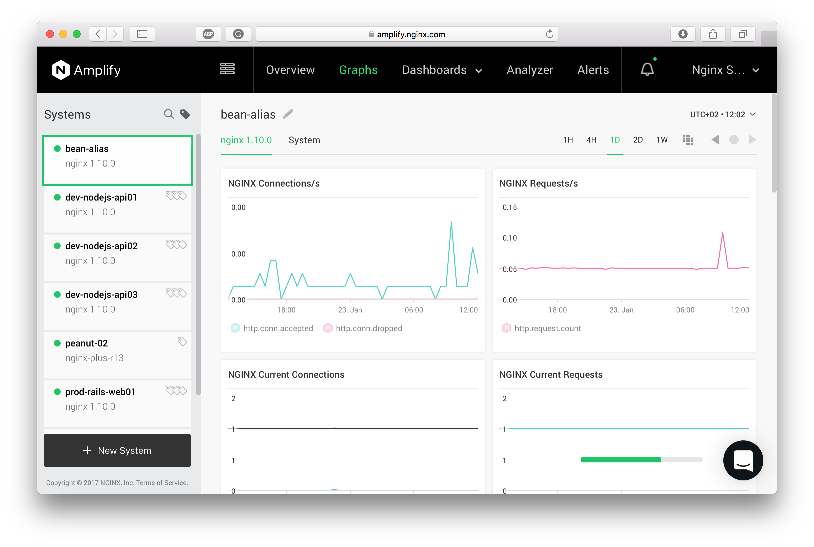
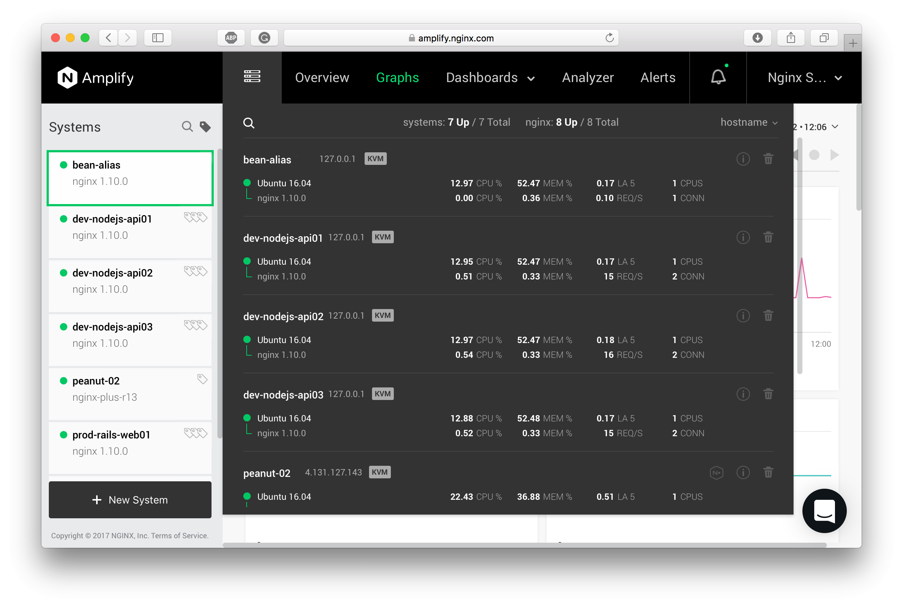

<!-- menu -->

<!-- START doctoc generated TOC please keep comment here to allow auto update -->
<!-- DON'T EDIT THIS SECTION, INSTEAD RE-RUN doctoc TO UPDATE -->


- [Overview](#overview)
  - [What Is NGINX Amplify?](#what-is-nginx-amplify)
  - [Main Components](#main-components)
- [How NGINX Amplify Agent Works](#how-nginx-amplify-agent-works)
  - [Metadata and Metrics Collection](#metadata-and-metrics-collection)
  - [Detecting and Monitoring NGINX Instances](#detecting-and-monitoring-nginx-instances)
  - [Configuring NGINX for Metric Collection](#configuring-nginx-for-metric-collection)
    - [Metrics from stub_status](#metrics-from-stub_status)
    - [Metrics from access.log and error.log](#metrics-from-accesslog-and-errorlog)
    - [Using Syslog for Metric Collection](#using-syslog-for-metric-collection)
  - [What to Check if the Agent Isn't Reporting Metrics](#what-to-check-if-the-agent-isnt-reporting-metrics)
  - [NGINX Configuration Analysis](#nginx-configuration-analysis)
  - [Source Code for NGINX Amplify Agent](#source-code-for-nginx-amplify-agent)
- [Installing and Managing NGINX Amplify Agent](#installing-and-managing-nginx-amplify-agent)
  - [Installing the Agent](#installing-the-agent)
    - [Using the Install Script](#using-the-install-script)
    - [Installing the Agent Manually](#installing-the-agent-manually)
      - [Installing on Ubuntu or Debian](#installing-on-ubuntu-or-debian)
      - [Installing on CentOS, Red Hat Linux, or Amazon Linux](#installing-on-centos-red-hat-linux-or-amazon-linux)
      - [Creating the Config File from a Template](#creating-the-config-file-from-a-template)
      - [Starting and Stopping the Agent](#starting-and-stopping-the-agent)
      - [Verifying that the Agent Has Started](#verifying-that-the-agent-has-started)
  - [Updating the Agent](#updating-the-agent)
  - [Configuring the Agent](#configuring-the-agent)
    - [Overriding the Effective User ID](#overriding-the-effective-user-id)
    - [Changing the API Key](#changing-the-api-key)
    - [Changing the Hostname and UUID](#changing-the-hostname-and-uuid)
    - [Configuring the URL for stub_status or Extended Status](#configuring-the-url-for-stub_status-or-extended-status)
    - [Configuring the Path to the NGINX Configuration File](#configuring-the-path-to-the-nginx-configuration-file)
    - [Configuring Syslog](#configuring-syslog)
    - [Excluding Certain NGINX Log Files](#excluding-certain-nginx-log-files)
    - [Setting Up a Proxy](#setting-up-a-proxy)
    - [Logging](#logging)
  - [Uninstalling the Agent](#uninstalling-the-agent)
- [User Interface](#user-interface)
  - [Graphs](#graphs)
  - [Inventory](#inventory)
  - [Dashboards](#dashboards)
  - [Analyzer](#analyzer)
  - [Alerts](#alerts)
  - [Account Settings](#account-settings)
- [Metrics and Metadata](#metrics-and-metadata)
  - [OS Metrics](#os-metrics)
  - [NGINX Metrics](#nginx-metrics)
    - [HTTP Connections and Requests](#http-connections-and-requests)
    - [HTTP Methods](#http-methods)
    - [HTTP Status Codes](#http-status-codes)
    - [HTTP Protocol Versions](#http-protocol-versions)
    - [NGINX Process Metrics](#nginx-process-metrics)
    - [Additional NGINX Metrics](#additional-nginx-metrics)
      - [Upstream Metrics](#upstream-metrics)
      - [Cache Metrics](#cache-metrics)
    - [NGINX Plus Metrics](#nginx-plus-metrics)
      - [Server Zone Metrics](#server-zone-metrics)
      - [Upstream Zone Metrics](#upstream-zone-metrics)
      - [Cache Zone Metrics](#cache-zone-metrics)
  - [Other metrics](#other-metrics)
    - [PHP-FPM metrics](#php-fpm-metrics)

<!-- END doctoc generated TOC please keep comment here to allow auto update -->

<!-- /menu -->

<!-- section:1 -->

## Overview

### What Is NGINX Amplify?

NGINX Amplify is a tool for comprehensive NGINX monitoring. With NGINX Amplify it's easy to proactively analyze and fix problems related to running and scaling NGINX-based web applications.

You can use NGINX Amplify to do the following:

  * Visualize and identify NGINX performance bottlenecks, overloaded servers, or potential DDoS attacks
  * Improve and optimize NGINX performance with intelligent advice and recommendations
  * Get notified when something is wrong with the application infrastructure
  * Plan web application capacity and performance
  * Keep track of the systems running NGINX

### Main Components

NGINX Amplify is a SaaS product, and it's hosted on AWS public cloud. It includes the following key components:

  * **NGINX Amplify Agent**

  The agent is a Python application that runs on monitored systems. All communications between the agent and the SaaS backend are done securely over SSL/TLS. All traffic is always initiated by the agent.

  * **NGINX Amplify Web UI**

  The user interface compatible with all major browsers. The web interface is accessible only via TLS/SSL.

  * **NGINX Amplify Backend** (implemented as a SaaS)

  The core system component, implemented as a SaaS. It encompasses scalable metrics collection infrastructure, a database, an analytics engine, and a core API.

<!-- /section:1 -->

<!-- section:2 -->

## How NGINX Amplify Agent Works

NGINX Amplify Agent is a compact application written in Python. Its role is to collect various metrics and metadata and send them securely to the backend for storage and visualization.

You will need to install the Amplify Agent on all hosts that you have to monitor.

After proper installation, the agent will automatically start to report metrics, and you should see the real-time metrics data in the NGINX Amplify web interface in about 60 seconds or so.

NGINX Amplify can currently monitor and collect performance metrics for:

  1. Operating system (see the list of supported OSes [here](https://github.com/nginxinc/nginx-amplify-doc/blob/master/amplify-faq.md#21-what-operating-systems-are-supported))
  2. NGINX and NGINX Plus
  3. [PHP-FPM](https://github.com/nginxinc/nginx-amplify-doc/blob/master/amplify-guide.md#php-fpm-metrics)

The agent considers an NGINX instance to be any running NGINX master process that has a unique path to the binary, and possibly a unique configuration.

**Note.**  There's no need to manually add or configure anything in the web interface after installing the agent. When the agent is started, the metrics and the metadata are automatically reported to the Amplify backend, and visualized in the web interface.

When a system or an NGINX instance is removed from the infrastructure for whatever reason, and is no longer reporting (and therefore no longer necessary), you should manually delete it in the web interface. The "Remove object" button can be found in the metadata viewer popup — see [**User Interface**](https://github.com/nginxinc/nginx-amplify-doc/blob/master/amplify-guide.md#user-interface) below.

### Metadata and Metrics Collection

NGINX Amplify Agent collects the following types of data:

  * **NGINX metrics.** The agent collects a lot of NGINX related metrics from [stub_status](http://nginx.org/en/docs/http/ngx_http_stub_status_module.html), the NGINX Plus extended status, the NGINX log files, and from the NGINX process state.
  * **System metrics.** These are various key metrics describing the system, e.g. CPU usage, memory usage, network traffic, etc.
  * **PHP-FPM metrics.** The agent can obtain metrics from the PHP-FPM pool status, if it detects a running PHP-FPM master process.
  * **NGINX metadata.** This is what describes your NGINX instances, and it includes package data, build information, the path to the binary, build configuration options, etc. NGINX metadata also includes the NGINX configuration elements.
  * **System metadata.** This is the basic information about the OS environment where the agent runs. This could be the hostname, uptime, OS flavor, and other data.

The agent will mostly use Python's [psutil()](https://github.com/giampaolo/psutil) to collect the metrics, but occasionally it may also invoke certain system utilities like *ps(1)*.

While the agent is running on the host, it collects metrics at regular 20 second intervals. Metrics then get downsampled and sent to the Amplify backend once a minute.

Metadata is also reported every minute. Changes in the metadata can be examined through the Amplify web interface.

NGINX config updates are reported only when a configuration change is detected.

If the agent is not able to reach the Amplify backend to send the accumulated metrics, it will continue to collect metrics, and will send them over to Amplify as soon as connectivity is re-established. The maximum amount of data that could be buffered by the agent is about 2 hour's worth.

### Detecting and Monitoring NGINX Instances

NGINX Amplify Agent is capable of detecting several types of NGINX instances:

  * Installed from a repository package
  * Built and installed manually

A separate instance of NGINX as seen by the agent would be the following:

  * A unique master process and its workers, started with an **absolute path** to a distinct NGINX binary
  * A master process running with a default config path, or with a custom path set in the command-line parameters

**Note.** The agent will try to detect and monitor all unique NGINX instances currently running on a host. Separate sets of metrics and metadata are collected for each unique NGINX instance.

### Configuring NGINX for Metric Collection

In order to monitor an NGINX instance, the agent should be able to [find the relevant NGINX master process](https://github.com/nginxinc/nginx-amplify-doc/blob/master/amplify-guide.md#detecting-and-monitoring-nginx-instances) first, and determine its key characteristics.

#### Metrics from stub_status

You need to define [stub_status](http://nginx.org/en/docs/http/ngx_http_stub_status_module.html) in your NGINX configuration for key NGINX graphs to appear in the web interface. If [stub_status](http://nginx.org/en/docs/http/ngx_http_stub_status_module.html) is already enabled, the agent should be able to locate it automatically.

If you're using NGINX Plus, then you need to configure either the *stub_status* module -or- the NGINX Plus [extended status](https://www.nginx.com/products/live-activity-monitoring/) monitoring.

Without *stub_status* or the NGINX Plus extended status, the agent will NOT be able to collect key NGINX metrics required for further monitoring and analysis.

Add the *stub_status* configuration as follows. You may also grab this config snippet [here](https://gist.githubusercontent.com/ptreyes/0b34d184de75f95478eb/raw/11f40f1ab7efb4278142054a11cea32323202320/stub_status.conf):

```

# cd /etc/nginx

# grep -i include\.*conf nginx.conf
    include /etc/nginx/conf.d/*.conf;

# cat > conf.d/stub_status.conf
server {
    listen 127.0.0.1:80;
    server_name 127.0.0.1;
    location /nginx_status {
        stub_status on;
        allow 127.0.0.1;
        deny all;
    }
}
<Ctrl-D>

# ls -la conf.d/stub_status.conf
-rw-r--r-- 1 root root 162 Nov  4 02:40 conf.d/stub_status.conf

# nginx -t
nginx: the configuration file /etc/nginx/nginx.conf syntax is ok
nginx: configuration file /etc/nginx/nginx.conf test is successful

# kill -HUP `cat /var/run/nginx.pid`
```

Don't forget to test your nginx configuration after you've added the *stub_status* section above.

**Note.** If you use **conf.d** directory to keep common parts of your NGINX configuration that are then automatically included in the [server](http://nginx.org/en/docs/http/ngx_http_core_module.html#server) sections across your NGINX config, do not use the snippet above. Instead you should configure [stub_status](http://nginx.org/en/docs/http/ngx_http_stub_status_module.html) manually within an appropriate location or server block.

**Note.** There's no need to use exactly the above example `nginx_status` URI for [stub_status](http://nginx.org/en/docs/http/ngx_http_stub_status_module.html). The agent will determine the correct URI automatically upon parsing your NGINX configuration. Please make sure that the directory and the actual configuration file with *stub_status* are readable by the agent, otherwise the agent won't be able to correctly determine the *stub_status* URL.

For more information about *stub_status*, please refer to the NGINX documentation [here](http://nginx.org/en/docs/http/ngx_http_stub_status_module.html).

Please make sure the *stub_status* ACL is correctly configured, especially if your system is IPv6-enabled. Test the reachability of *stub_status* metrics with *wget(1)* or *curl(1)*. When testing, use the exact URL matching your NGINX configuration. That is, don't test it against localhost if *stub_status* is configured for a server that doesn't listen on 127.0.0.1.

If everything is configured properly, you should see something along these lines when testing it with *curl(1)*:

```
$ curl http://localhost/nginx_status
Active connections: 2
server accepts handled requests
 344014 344014 661581
Reading: 0 Writing: 1 Waiting: 1
```

The agent uses data from *stub_status* to calculate metrics related to server-wide HTTP connections and requests as described below:

```
nginx.http.conn.accepted = stub_status.accepts
nginx.http.conn.active = stub_status.active - stub_status.waiting
nginx.http.conn.current = stub_status.active
nginx.http.conn.dropped = stub_status.accepts - stub_status.handled
nginx.http.conn.idle = stub_status.waiting
nginx.http.request.count = stub_status.requests
nginx.http.request.current = stub_status.reading + stub_status.writing
nginx.http.request.reading = stub_status.reading
nginx.http.request.writing = stub_status.writing
```

For NGINX Plus the agent will automatically use similar metrics available from the extended status output.

For more information about the metric list, please refer to [**Metrics and Metadata**](https://github.com/nginxinc/nginx-amplify-doc/blob/master/amplify-guide.md#metrics-and-metadata).

#### Metrics from access.log and error.log

NGINX Amplify Agent will also collect more NGINX metrics from the [access.log](http://nginx.org/en/docs/http/ngx_http_log_module.html) and the [error.log](http://nginx.org/en/docs/ngx_core_module.html#error_log) files. In order to do that, the agent should be able to read the logs. Make sure that either the `nginx` user or the user [defined in the NGINX config](http://nginx.org/en/docs/ngx_core_module.html#user) (such as `www-data`) can read the log files. Please also make sure that the log files are being written normally.

You don't have to specifically point the agent to either the NGINX configuration or the NGINX log files — it should detect their location automatically.

The agent will also try to detect the [log format](http://nginx.org/en/docs/http/ngx_http_log_module.html#log_format) for a particular log, in order to be able to parse it properly and possibly extract even more useful metrics, e.g. [$upstream_response_time](http://nginx.org/en/docs/http/ngx_http_upstream_module.html#var_upstream_response_time).

**Note.** A number of metrics outlined in [**Metrics and Metadata**](https://github.com/nginxinc/nginx-amplify-doc/blob/master/amplify-guide.md#metrics-and-metadata) will only be available if the corresponding variables are included in a custom [access.log](http://nginx.org/en/docs/http/ngx_http_log_module.html) format used for logging requests. You can find a complete list of NGINX log variables [here](http://nginx.org/en/docs/varindex.html).

#### Using Syslog for Metric Collection

If you configured the agent for syslog metric collection (see [below](https://github.com/nginxinc/nginx-amplify-doc/blob/master/amplify-guide.md#configuring-syslog)), make sure to add the following settings to the NGINX configuration:

  1. Check that you are using NGINX version 1.9.5 or newer (or NGINX Plus Release 8 or newer).
  2. Edit the NGINX configuration file and specify the syslog listener address as the first parameter to the [access.log](http://nginx.org/en/docs/http/ngx_http_log_module.html) directive. Include the `amplify` tag, and your preferred log format:

  ```
  access_log syslog:server=127.0.0.1:12000,tag=amplify,severity=info main_ext;
  ```

  (see also how to extend the NGINX log format to collect [additional metrics](https://github.com/nginxinc/nginx-amplify-doc/blob/master/amplify-guide.md#additional-nginx-metrics))

  3. Reload NGINX:

  ```
  # nginx -s reload
  ```

  (or `service nginx reload`)

**Note**: To send the NGINX logs to both the existing logging facility and the Amplify Agent, include a separate [access.log](http://nginx.org/en/docs/http/ngx_http_log_module.html) directive for each destination.

### What to Check if the Agent Isn't Reporting Metrics

After you [install and start](https://github.com/nginxinc/nginx-amplify-doc/blob/master/amplify-guide.md#installing-and-managing-nginx-amplify-agent) the agent, normally it should just start reporting right away, pushing aggregated data to the Amplify backend at regular 1 minute intervals. It'll take about a minute for a new system to appear in the Amplify web interface.

If you don't see the new system or NGINX in the web interface, or (some) metrics aren't being collected, please check the following:

  1. The Amplify Agent package has been successfully [installed](https://github.com/nginxinc/nginx-amplify-doc/blob/master/amplify-guide.md#installing-and-managing-nginx-amplify-agent), and no warnings were seen upon the installation.
  2. The `amplify-agent` process is running and updating its [log file](https://github.com/nginxinc/nginx-amplify-doc/blob/master/amplify-guide.md#logging).
  3. The agent is running under the same user as your NGINX worker processes.
  4. The NGINX is started with an absolute path. Currently the agent **can't** detect NGINX instances launched with a relative path (e.g. "./nginx").
  5. The [user ID that is used by the agent and the NGINX ](https://github.com/nginxinc/nginx-amplify-doc/blob/master/amplify-guide.md#overriding-the-effective-user-id), can run *ps(1)* to see all system processes. If *ps(1)* is restricted for non-privileged users, the agent won't be able to find and properly detect the NGINX master process.
  6. The time is set correctly. If the time on the system where the agent runs is ahead or behind the world's clock, you won't be able to see the graphs.
  7. *stub_status* is [properly configured](https://github.com/nginxinc/nginx-amplify-doc/blob/master/amplify-guide.md#configuring-nginx-for-metric-collection), and the *stub_status module* is included in the NGINX build (this can be checked with `nginx -V`).
  8. NGINX [access.log](http://nginx.org/en/docs/http/ngx_http_log_module.html) and [error.log](http://nginx.org/en/docs/ngx_core_module.html#error_log) files are readable by the user `nginx` (or by the [user](http://nginx.org/en/docs/ngx_core_module.html#user) set in NGINX config).
  9. All NGINX configuration files are readable by the agent user ID (check owner, group and permissions).
  10. Extra [configuration steps have been performed as required](https://github.com/nginxinc/nginx-amplify-doc/blob/master/amplify-guide.md#additional-nginx-metrics) for the additional metrics to be collected.
  11. The system DNS resolver is correctly configured, and *receiver.amplify.nginx.com* can be successfully resolved.
  12. Oubound TLS/SSL from the system to *receiver.amplify.nginx.com* is not restricted. This can be checked with *curl(1)*. [Configure a proxy server](https://github.com/nginxinc/nginx-amplify-doc/blob/master/amplify-guide.md#setting-up-a-proxy) for the agent if required.
  13. *selinux(8)*, *apparmor(7)* or [grsecurity](https://grsecurity.net) are not interfering with the metric collection. E.g. for *selinux(8)* check **/etc/selinux/config**, try `setenforce 0` temporarily and see if it improves the situation for certain metrics.
  14. Some VPS providers use hardened Linux kernels that may restrict non-root users from accessing */proc* and */sys*. Metrics describing system and NGINX disk I/O are usually affected. There is no an easy workaround for this except for allowing the agent to run as `root`. Sometimes fixing permissions for */proc* and */sys/block* may work.

### NGINX Configuration Analysis

NGINX Amplify Agent is able to automatically find all relevant NGINX configuration files, parse them, extract their logical structure, and send the associated JSON data to the Amplify backend for further analysis and reporting. For more information on configuration analysis, please see the [**Analyzer**](https://github.com/nginxinc/nginx-amplify-doc/blob/master/amplify-guide.md#analyzer) section below.

After the agent finds a particular NGINX configuration, it then automatically starts to keep track of its changes. When a change is detected with NGINX — e.g. a master process restarts, or the NGINX config is edited, an update is sent to the Amplify backend.

**Note.** The agent DOES NOT ever send the raw unprocessed config files to the backend system. In addition, the following directives in the NGINX configuration are NOT analyzed — and their parameters ARE NOT exported to the SaaS backend:
[ssl_certificate_key](http://nginx.org/en/docs/mail/ngx_mail_ssl_module.html#ssl_certificate_key), [ssl_client_certificate](http://nginx.org/en/docs/mail/ngx_mail_ssl_module.html#ssl_client_certificate), [ssl_password_file](http://nginx.org/en/docs/mail/ngx_mail_ssl_module.html#ssl_password_file), [ssl_stapling_file](http://nginx.org/en/docs/http/ngx_http_ssl_module.html#ssl_stapling_file), [ssl_trusted_certificate](http://nginx.org/en/docs/http/ngx_http_ssl_module.html#ssl_trusted_certificate), [auth_basic_user_file](http://nginx.org/en/docs/http/ngx_http_auth_basic_module.html#auth_basic_user_file), [secure_link_secret](http://nginx.org/en/docs/http/ngx_http_secure_link_module.html#secure_link_secret).

### Source Code for NGINX Amplify Agent

NGINX Amplify Agent is an open source application. It is licensed under the [2-clause BSD license](https://github.com/nginxinc/nginx-amplify-agent/blob/master/LICENSE), and is available here:

  * Sources: https://github.com/nginxinc/nginx-amplify-agent
  * Public package repository: http://packages.amplify.nginx.com
  * Install script for Linux: https://github.com/nginxinc/nginx-amplify-agent/raw/master/packages/install.sh
  * A script to install the agent when the package is not available: https://raw.githubusercontent.com/nginxinc/nginx-amplify-agent/master/packages/install-source.sh

<!-- /section:2 -->

<!-- section:3 -->

## Installing and Managing NGINX Amplify Agent

### Installing the Agent

In order to be able to use NGINX Amplify to monitor your infrastructure, you need to install NGINX Amplify Agent on each system that has to be checked.

**Note.** The agent will drop *root* privileges on startup. It will then use the user ID of the user `nginx` to set its effective user ID. The package install procedure will add the `nginx` user automatically unless it's already found in the system. If the [user](http://nginx.org/en/docs/ngx_core_module.html#user) directive appears in the NGINX configuration, the agent will pick up the user specified in the NGINX config for its effective user ID (e.g. `www-data`).

#### Using the Install Script

The installation procedure can be as simple as this.

<!-- advancedList -->

  1. Download and run the install script.

  ```
  # curl -sS -L -O \
  https://github.com/nginxinc/nginx-amplify-agent/raw/master/packages/install.sh && \
  API_KEY='ffeedd0102030405060708' sh ./install.sh
  ```

  where API_KEY is a unique API key assigned to your Amplify account. You will see your API key when adding a new system in the Amplify web interface. You can also find the API key in the **Account** menu.

  2. Verify that the agent has started.

  ```
  # ps ax | grep -i 'amplify\-'
  2552 ?        S      0:00 amplify-agent
  ```

#### Installing the Agent Manually

##### Installing on Ubuntu or Debian

<!-- advancedList -->

  1. Add the NGINX public key.

  ```
  # curl -fs http://nginx.org/keys/nginx_signing.key | apt-key add -
  ```

  or

  ```
  # wget -q -O - \
  http://nginx.org/keys/nginx_signing.key | apt-key add -
  ```

  2. Configure the repository as follows.

  ```
  # codename=`lsb_release -cs` && \
  os=`lsb_release -is | tr '[:upper:]' '[:lower:]'` && \
  echo "deb http://packages.amplify.nginx.com/${os}/ ${codename} amplify-agent" > \
  /etc/apt/sources.list.d/nginx-amplify.list
  ```

  3. Verify the repository config file (Ubuntu 14.04 example follows).

  ```
  # cat /etc/apt/sources.list.d/nginx-amplify.list
  deb http://packages.amplify.nginx.com/ubuntu/ trusty amplify-agent
  ```

  4. Update the package index files.

  ```
  # apt-get update
  ```

  5. Install and run the agent.

  ```
  # apt-get install nginx-amplify-agent
  ```

##### Installing on CentOS, Red Hat Linux, or Amazon Linux

<!-- advancedList -->

  1. Add the NGINX public key.

  ```
  # curl -sS -L -O http://nginx.org/keys/nginx_signing.key && \
  rpm --import nginx_signing.key
  ```

  or

  ```
  # wget -q -O nginx_signing.key http://nginx.org/keys/nginx_signing.key && \
  rpm --import nginx_signing.key
  ```

  2. Create the repository config as follows (mind the correct release number).

  Use the first snippet below for CentOS and Red Hat Linux. The second one applies to Amazon Linux.

  ```
  # release="7" && \
  printf "[nginx-amplify]\nname=nginx amplify repo\nbaseurl=http://packages.amplify.nginx.com/centos/${release}/\$basearch\ngpgcheck=1\nenabled=1\n" > \
  /etc/yum.repos.d/nginx-amplify.repo
  ```

  ```
  # release="latest" && \
  printf "[nginx-amplify]\nname=nginx amplify repo\nbaseurl=http://packages.amplify.nginx.com/amzn/${release}/\$basearch\ngpgcheck=1\nenabled=1\n" > \
  /etc/yum.repos.d/nginx-amplify.repo
  ```

  3. Verify the repository config file (RHEL 7.1 example follows).

  ```
  # cat /etc/yum.repos.d/nginx-amplify.repo
  [nginx-amplify]
  name=nginx repo
  baseurl=http://packages.amplify.nginx.com/centos/7/$basearch
  gpgcheck=1
  enabled=1
  ```

  4. Update the package metadata.

  ```
  # yum makecache
  ```

  5. Install and run the agent.

  ```
  # yum install nginx-amplify-agent
  ```

##### Creating the Config File from a Template

```
# api_key="ffeedd0102030405060708" && \
sed "s/api_key.*$/api_key = ${api_key}/" \
/etc/amplify-agent/agent.conf.default > \
/etc/amplify-agent/agent.conf
```

API_KEY is a unique API key assigned to your Amplify account. You will see your API key when adding a new system in the Amplify web interface. You can also find the API key in the *Account* menu.

##### Starting and Stopping the Agent

```
# service amplify-agent start
```

```
# service amplify-agent stop
```

##### Verifying that the Agent Has Started

```
# ps ax | grep -i 'amplify\-'
2552 ?        S      0:00 amplify-agent
```

### Updating the Agent

It is *highly* recommended that you periodically check for updates and install the latest stable version of the agent.

<!-- advancedList -->

  1. On Ubuntu/Debian use:

  ```
  # apt-get update && \
  apt-get install nginx-amplify-agent
  ```

  2. On CentOS/Red Hat use:

  ```
  # yum makecache && \
  yum update nginx-amplify-agent
  ```

### Configuring the Agent

NGINX Amplify Agent's configuration file is **/etc/amplify-agent/agent.conf**

#### Overriding the Effective User ID

NGINX Amplify Agent will drop *root* privileges on startup. By default it will then use the user ID of the user `nginx` to set its effective user ID. The package install procedure will add the `nginx` user automatically unless it's already found in the system. If the [user](http://nginx.org/en/docs/ngx_core_module.html#user) directive appears in the NGINX configuration, the agent will pick up the user specified in the NGINX config for its effective user ID (e.g. `www-data`).

It is really important for the agent and the running NGINX instances to use the same user ID, so that the agent is able to properly collect all NGINX metrics.

In case you'd like to manually specify the user ID that the agent should use for its effective user ID, there's a specialized section in **/etc/amplify-agent/agent.conf** for that:

```
[nginx]
user =
configfile = /etc/nginx/nginx.conf
```

There's an option here to explicitly set the real user ID which the agent should pick for its effective user ID. If the `user` directive has a non-empty parameter, the agent startup script will use it to look up the real user ID.

In addition, there's another option to explicitly tell the agent where it should look for an NGINX configuration file suitable for detecting the real user ID. It's **/etc/nginx/nginx.conf** by default.

#### Changing the API Key

When you first install the agent using the procedure above, your API key is written to the `agent.conf` file automatically. If you ever need to change the API key, please edit the following section in `agent.conf` accordingly:

```
[credentials]
api_key = ffeedd0102030405060708
```

#### Changing the Hostname and UUID

In order to create unique objects for monitoring, the agent must be able to extract a valid hostname from the system. The hostname is also utilized as one of the components for generating a unique identifier. Essentially, the hostname and the UUID unambiguously identify a particular instance of the agent to the Amplify backend. If the hostname or the UUID are changed, the agent and the backend will register a new object for monitoring.

When first generated, the uuid is written to `agent.conf`. Typically this happens automatically when the agent starts and successfully detects the hostname for the first time. Normally you SHOULD NOT change the UUID in `agent.conf`.

The agent will try its best to determine the correct hostname. If it fails to determine the hostname, you can set the hostname manually in the `agent.conf` file. Check for the following section, and put the desired hostname in here:

```
[credentials]
..
hostname = myhostname1
```

The hostname should be something real. The agent won't start unless a valid hostname is defined. The following *aren't* valid hostnames:

  * localhost
  * localhost.localdomain
  * localhost6.localdomain6
  * ip6-localhost

**Note.** You can also use the above method to replace the system's hostname with an arbitrary alias. Keep in mind that if you redefine the hostname for a live object, the existing object will be marked as failed in the web interface. Redefining the hostname in the agent's configuration essentially creates a new UUID, and a new system for monitoring.

#### Configuring the URL for stub_status or Extended Status

When the agent finds a running NGINX instance, it automatically detects the [stub_status](http://nginx.org/en/docs/http/ngx_http_stub_status_module.html) or the NGINX Plus [extended status](https://www.nginx.com/products/live-activity-monitoring/) locations from the NGINX configuration.

To override the *stub_status* URI/URL, use the `stub_status` configuration option.

```
[nginx]
..
stub_status = http://127.0.0.1/nginx_status
```

To override the extended status URI/URL, use the `plus_status` option.

```
[nginx]
..
plus_status = /status
```

**Note.** If only the URI part is specified with the options above, the agent will use `http://127.0.0.1` to construct the full URL to access either the *stub_status* or the NGINX Plus extended status metrics.

#### Configuring the Path to the NGINX Configuration File

The agent detects the NGINX configuration file *automatically*. You DO NOT need to explicitly point the agent to the **nginx.conf**.

If for some reason the agent is not able to find the NGINX configuration, use the following option in **/etc/amplify-agent/agent.conf**:

```
[nginx]
configfile = /etc/nginx/nginx.conf
```

**Note**. It is better to avoid using this option and only add it as a workaround. Please take some time to fill out a support ticket in case you had to manually add the path to the NGINX config file. (this would be really much appreciated!)

#### Configuring Syslog

The agent can collect the NGINX log files via `syslog`. This could be useful when you don't keep the NGINX logs on disk, or when monitoring a container environment such as [Docker](https://github.com/nginxinc/docker-nginx-amplify) with NGINX Amplify.

To configure the agent for syslog, add the following to the **/etc/amplify-agent/agent.conf**:

```
[listeners]
keys = syslog-default

[listener_syslog-default]
address = 127.0.0.1:12000
```

Restart the agent to have it reparse the configuration and start listening on the specified IP address and port:

```
# service amplify-agent restart
```

Make sure to [add](https://github.com/nginxinc/nginx-amplify-doc/blob/master/amplify-guide.md#using-syslog-for-metric-collection) the `syslog` settings to your NGINX configuration as well.

#### Excluding Certain NGINX Log Files

By default the agent will try to find and watch all **access.log** files described in the NGINX configuration. If there are multiple log files where the same request is logged, the metrics may get counted more than once.

To exclude specific NGINX log files from the metric collection, add something along these lines to **/etc/amplify-agent/agent.conf**:

```
[nginx]
exclude_logs=/var/log/nginx/app1/*,access-app1-*.log,sender1-*.log
```

#### Setting Up a Proxy

If your system is in a DMZ environment without direct access to the Internet, the only way for the agent to report collected metrics to Amplify would be through a proxy.

The agent obeys the usual environment variables that are common on Linux systems (e.g. `https_proxy` or `HTTP_PROXY`). However, you can also define HTTPS proxy manually in `agent.conf`. This could be done as follows:

```
[proxies]
https = https://10.20.30.40:3030
..
```

#### Logging

The agent maintains its log file in **/var/log/amplify-agent/agent.log**

Upon installation, the agent's log rotation schedule is added to **/etc/logrotate.d/amplify-agent**

The normal level of logging for the agent is `INFO`. If you ever need to debug the agent, change the level to `DEBUG` as follows. Bear in mind, the size of the agent's log file can grow really fast with `DEBUG`:

```

[logger_agent-default]
level = DEBUG
..

[handler_agent-default]
class = logging.handlers.WatchedFileHandler
level = DEBUG
..
```

### Uninstalling the Agent

To completely delete a previously monitored object, perform the following steps:

<!-- advancedList -->

  1. Uninstall the agent

  On Ubuntu/Debian use:

  ```
  apt-get remove nginx-amplify-agent
  ```

  On CentOS and Red Hat use:

  ```
  yum remove nginx-amplify-agent
  ```

  2. Delete objects from the web interface

  To delete a system using the web interface — find it in the [Inventory](https://github.com/nginxinc/nginx-amplify-doc/blob/master/amplify-guide.md#inventory), and choose the [i] icon. You can delete objects from the popup window that appears next.

  Bear in mind — deleting objects in the UI will not stop the agent. To completely remove a system from monitoring, stop and/or uninstall the agent first, and then clean it up in the web interface. Don't forget to also clean up any alert rules.

  3. Delete alerts

  Check the [Alerts](https://github.com/nginxinc/nginx-amplify-doc/blob/master/amplify-guide.md#alerts) page and remove/mute the irrelevant rules.

<!-- /section:3 -->

<!-- section:4 -->

## User Interface

### Graphs

When you log in to Amplify, you’re presented with a collection of predefined graphs on the **Graphs** page. Here you can see an overview of the key metric stats, such as CPU, memory, and disk usage for all of your systems.

If you click on a system on the left, the graphs will change to reflect the metrics for the selected system. The graphs are further split into tabs such as "System", "NGINX" and so on.



Some graphs have an additional selector. E.g., with "Disk Latency" or "Network Traffic" you can select what device or interface you're analyzing.

On the right, above the graphs, you will find the time range selector, which helps to display different time periods for the graphs.

You can also copy a predefined graph to a custom dashboard by focusing on the graph and clicking on the arrow in the top right corner.

Check the [Metrics and Metadata](https://github.com/nginxinc/nginx-amplify-doc/blob/master/amplify-guide.md#metrics-and-metadata) section below to learn more about the displayed metrics.

### Inventory

From the top menu bar, you can always open the inventory of the systems that are being monitored. When the agent is properly installed on a new system and reporting, it's automatically visible in the system index on the left and in the **Inventory**.



The **Inventory** allows you to check the status of all systems at a glance. It also provides a quick overview of the key metrics.

In the rightmost column of the **Inventory** you will also find the settings and the metadata viewer icons. Click on the [i] icon and the popup will appear with various useful information about the OS and the monitored NGINX instances. If you need to remove an object from the monitoring, it's in the metadata viewer popup where you can find the "Remove object" buttons. Removing the OS object will delete the NGINX objects too.

You can apply sorting, search, and filters to the **Inventory** to quickly find the system in question. You can search and filter by hostname, IP address, architecture etc. You can use regular expressions with the search function.

**Note.** Bear in mind, that you'd also need to stop or uninstall the agent on the systems being removed from the monitoring, otherwise the objects will reappear in the UI. Be sure to delete any system specific alert rules too.

### Dashboards

You can create your own dashboards populated with highly customizable graphs of NGINX and system-level metrics.

Some of the use cases for a custom set of graphs are the following:

  * Checking NGINX performance for a particular application or microservice, e.g. based on the URI path
  * Displaying metrics per virtual server
  * Visualizing the performance of a group of NGINX servers — for example, front-end load balancers, or an NGINX edge caching layer
  * Analyzing a detailed breakdown of HTTP status codes per application

When building a custom graph, metrics can be summed or averaged across several NGINX servers. By using metric filters it is also possible to create additional “metric dimensions” — for example, reporting the number of POST requests for a specific URI.

To create a custom dashboard, click **CREATE DASHBOARD** on the **Dashboards** drop-down menu. Then click **New Graph** in the upper right corner to start adding graphs to the dashboard.

When adding or editing a graph, the following dialog appears:


To define a graph, perform these steps:

  1. Enter the graph title.
  2. Pick one or more metrics. You can combine multiple metrics on the same graph using the "Add another metric" button.
  3. After the metric is selected, you are able to see the systems for which the metric has been observed. Select one or multiple systems here. You can also use tags to specify the systems.
  4. When aggregating across multiple systems, select either "Sum" or "Avg" as the aggregation function.
  5. Last but not least, the “filter” functionality is also available for NGINX metrics collected from the log files. If you click on "Add metric filter", you can then add multiple criteria in order to define specific "metric dimensions". In the example above, we are matching the NGINX upstream response time against the **/api/feed/reports** URI. You can also build other filters, e.g. displaying metric **nginx.http.status.2xx** for the responses with the status code 201.
  6. Click "Save" when you're done, and the graph is added to the dashboard. You can also edit the graph later on if needed, move it around, resize, stack the graphs on top of each other, etc.

**Note.** When using filters, all the "metric dimensions" aren't stored in the NGINX Amplify backend by default. A particular filter starts to slice the metric according to the specification only after the graph is created. Hence, it can be a while before the "filtered" metric is displayed on the graph — the end result depends on how quickly the log files are being populated with the new entries, but typically you should see the first data points in under 5 minutes.

Because NGINX Amplify is **not** a SaaS log analyzer, the additional slicing for "metric dimensions" is implemented inside the agent. The agent can parse the NGINX access logs on-the-fly and extract all the necessary metrics **without** sending the raw log entries elsewhere. Moreover, the agent understands custom log formats automatically, and will start looking for various newly defined "metric dimensions" following a particular [log_format](http://nginx.org/en/docs/http/ngx_http_log_module.html#log_format) specification.

Essentially, the agent performs a combination of real-time log analytics and standard metrics collection (e.g. metrics from the *stub_status* module). The agent does only the **real-time log processing**, and always on the same host where it is running.

Metric filters can be really powerful. By using the filters and creating additional "metric dimensions", it is possible to build highly granular and very informative graphs. To enable the agent to slice the metrics you must add the corresponding log variables to the active NGINX log format. Please see the [Additional NGINX metrics](https://github.com/nginxinc/nginx-amplify-doc/blob/master/amplify-guide.md#additional-nginx-metrics) section below.

Metric filters are available only for the metrics generated from the log files. For other metrics some additional modifiers can be set when editing a graph. E.g. for NGINX Plus it is possible to specify the extended status zones to build more detailed visualizations.

When editing a custom dashboard, you can also use additional features like "Clone" or "New Set" to streamline the worklow. The "New Set" function in particular can be very helpful to quickly create various metric visualizations for NGINX or the operating system.

### Analyzer

NGINX Amplify Agent parses NGINX configuration files and transmits them to the backend component for further analysis. This is where Amplify offers configuration recommendations to help improve the performance, reliability, and security of your applications. With well-thought-out and detailed recommendations you’ll know exactly where the problem is, why it is a problem, and how to fix it.

When you switch to the **Analyzer** page, click on a particular system on the left in order to see the associated report. Unless an NGINX instance is found on a system, there will be no report for it.

The following information is provided when a report is run against an NGINX config structure:

  * Version information
    * Branch, release date, and the latest version in the branch
  * Overview
    * Path to NGINX config files(s)
    * Whether the parser failed or not, and the results of `nginx -t`
    * Last-modified info
    * 3rd party modules found
    * Breakdown of the key configuration elements (servers, locations, upstreams)
    * Breakdown of IPv4/IPv6 usage
  * Security
    * Any security advisories that apply to this version of NGINX
  * Virtual servers
    * Breakdown of the virtual host configuration (think "apachectl -S")
  * SSL
    * OpenSSL version information
    * Breakdown of the number of SSL or HTTP/2 servers configured
    * Information about the configured SSL certificates
    * Warnings about common SSL configuration errors
  * Static analysis
    * Various suggestions about configuration structure
    * Typical configuration gotchas highlighted
    * Common advice about proxy configurations
    * Suggestions about simplifying rewrites for certain use cases
    * Key security measures (e.g. *stub_status* is unprotected)
    * Typical errors in configuring locations, especially with *regex*

To parse SSL certificate metadata the Amplify Agent uses standard openssl(1) functions. SSL certificates are parsed and analyzed only when the corresponding [settings](https://github.com/nginxinc/nginx-amplify-doc/blob/master/amplify-guide.md#account-settings) are turned on. SSL certificate analysis is *off* by default.

Static analysis will only include information about specific issues with the NGINX configuration if those are found in your NGINX setup.

In the future, the **Analyzer** page will also include *dynamic analysis*, effectively linking the observed NGINX behavior to its configuration — e.g. when it makes sense to increase or decrease certain parameters like [proxy_buffers](http://nginx.org/en/docs/http/ngx_http_proxy_module.html#proxy_buffers) etc. Stay tuned!

**Note.** Config analysis is *on* by default. If you don't want your NGINX configuration to be checked, unset the corresponding setting in either Global, or Local (per-system) settings. See [**Settings**](https://github.com/nginxinc/nginx-amplify-doc/blob/master/amplify-guide.md#account-settings) below.

### Alerts

The **Alerts** page describes the configuration of the alert rules used to notify you of any anomalies in the behavior of your systems.

Alerts are based on setting a rule to monitor a particular metric. Alert rules allow the user to specify the metric, the trigger condition, the threshold, and the email for notifications.

The way alert rules work is the following:

  1. Incoming metric updates are being continuously monitored against the set of rules.
  2. If there's a rule for a metric, the new metric update is checked against the threshold.
  3. If the threshold is met, an alert notification is generated, and the rule will continue to be monitored.
  4. If subsequent metric updates show that the metric no longer violates the threshold for the configured period, the alert is cleared.

By default there's no filtering by host. If a specific alert should only be raised for a particular system, you should specify the hostname(s) or tags when configuring the alert. Currently metrics can't be aggregated across all systems; instead any system will match a particular rule unless a host is specified.

There's one special rule which is the about **amplify.agent.status** metric. This metric reflects the state of the agent (and hence, the state of the system as seen by Amplify). You can only configure a 2 minute interval and only 0 (zero) as the threshold for **amplify.agent.status**.

You shouldn't see consecutive notifications about the same alert over and over again. Instead there will be digest information sent out *every 30 minutes*, describing which alerts were generated and which ones were cleared.

**Note.** Gauges are *averaged* over the interval configured in the rule. Counters are *summed up*. Currently that's not user configurable and these are the only reduce functions available for configuring metric thresholds.

**Note.** Emails are sent using [AWS SES](https://aws.amazon.com/ses/). Make sure your mail relay accepts their traffic. Also make sure to verify the specified email and check the verification status in the Account menu.

### Account Settings

The **Account** option in the "hamburger" menu at the top right corner of the web interface contains various important settings.

First of all, you can always check the information you provided upon signing up, and edit specific fields.

You can also see the current limits such as "maximum number of agents", "maximum number of custom dashboards", etc.

The global settings section is used to enable or disable account-wide behavior for:

  * NGINX configuration files analysis
  * Periodic NGINX configuration syntax checking with "nginx -t"
  * Analyzing SSL certs

Per-system settings are accessible via the "Settings" icon that can be found for a particular system in the [**Inventory**](https://github.com/nginxinc/nginx-amplify-doc/blob/master/amplify-guide.md#inventory).

Per-system settings override the global settings. If you generally prefer to monitor your NGINX configurations on all but some specific systems, you can uncheck the corresponding settings in the per-system settings menu.

In the **Emails** section you will find the information about the emails currently registered with your account, and whether they are verified or not. The alert notifications are only sent to verified emails.

Last but not least, inside the **Users** section you will see the list of the user logins that are associated with this particular account. If you are the admin user, you can also invite your team members to the account.

<!-- /section:4 -->

<!-- section:5 -->

## Metrics and Metadata

Most metrics are collected by the agent without requiring the user to perform any additional setup. For troubleshooting, see [**What to Check if the Agent Isn't Reporting Metrics**](https://github.com/nginxinc/nginx-amplify-doc/blob/master/amplify-guide.md#what-to-check-if-the-agent-isnt-reporting-metrics).

Some additional metrics for NGINX monitoring will only be reported if the NGINX configuration file is modified accordingly. See [**Additional NGINX Metrics**](https://github.com/nginxinc/nginx-amplify-doc/blob/master/amplify-guide.md#additional-nginx-metrics) below, and pay attention to the *Source* and *Variable* fields in the metric descriptions that follow.

### OS Metrics

  * **amplify.agent.status**

<!-- json:metric["amplify.agent.status"] -->
  ```
  Type:        internal, integer
  Description: 1 - agent is up, 0 - agent is down.
  ```
<!-- /json:metric -->

  * **amplify.agent.cpu.system**
  * **amplify.agent.cpu.user**

<!-- json:metric["amplify.agent.cpu.system","amplify.agent.cpu.user"] -->
  ```
  Type:        gauge, percent
  Description: CPU utilization percentage observed from the agent process.
  ```
<!-- /json:metric -->

  * **amplify.agent.mem.rss**
  * **amplify.agent.mem.vms**

<!-- json:metric["amplify.agent.mem.rss","amplify.agent.mem.vms"] -->
  ```
  Type:        gauge, bytes
  Description: Memory utilized by the agent process.
  ```
<!-- /json:metric -->

  * **system.cpu.idle**
  * **system.cpu.iowait**
  * **system.cpu.system**<!-- anchor:system.cpu.system -->
  * **system.cpu.user**<!-- anchor:system.cpu.user -->

<!-- json:metric["system.cpu.idle","system.cpu.iowait","system.cpu.system","system.cpu.user"] -->
  ```
  Type:        gauge, percent
  Description: System CPU utilization.
  ```
<!-- /json:metric -->

  * **system.cpu.stolen**

<!-- json:metric["system.cpu.stolen"] -->
  ```
  Type:        gauge, percent
  Description: System CPU stolen. Represents time when the real CPU was not available to
               the current VM.
  ```
<!-- /json:metric -->

  * **system.disk.free**
  * **system.disk.total**
  * **system.disk.used**

<!-- json:metric["system.disk.free","system.disk.total","system.disk.used"] -->
  ```
  Type:        gauge, bytes
  Description: System disk usage statistics.
  ```
<!-- /json:metric -->

  * **system.disk.in_use**

<!-- json:metric["system.disk.in_use"] -->
  ```
  Type:        gauge, percent
  Description: System disk usage statistics, percentage.
  ```
<!-- /json:metric -->

  * **system.io.iops_r**
  * **system.io.iops_w**

<!-- json:metric["system.io.iops_r","system.io.iops_w"] -->
  ```
  Type:        counter, integer
  Description: Number of reads or writes per sampling window.
  ```
<!-- /json:metric -->

  * **system.io.kbs_r**
  * **system.io.kbs_w**

<!-- json:metric["system.io.kbs_r","system.io.kbs_w"] -->
  ```
  Type:        counter, kilobytes
  Description: Number of kilobytes read or written.
  ```
<!-- /json:metric -->

  * **system.io.wait_r**
  * **system.io.wait_w**

<!-- json:metric["system.io.wait_r","system.io.wait_w"] -->
  ```
  Type:        gauge, milliseconds
  Description: Time spent reading from or writing to disk.
  ```
<!-- /json:metric -->

  * **system.load.1**<!-- anchor:system.load.1 -->
  * **system.load.5**<!-- anchor:system.load.5 -->
  * **system.load.15**

<!-- json:metric["system.load.1","system.load.5","system.load.15"] -->
  ```
  Type:        gauge, float
  Description: Number of processes in the system run queue, averaged over the last 1, 5,
               and 15 min.
  ```
<!-- /json:metric -->

  * **system.mem.available**
  * **system.mem.buffered**
  * **system.mem.cached**
  * **system.mem.free**
  * **system.mem.shared**
  * **system.mem.total**
  * **system.mem.used**<!-- anchor:system.mem.used -->

<!-- json:metric["system.mem.available","system.mem.buffered","system.mem.cached","system.mem.free","system.mem.shared","system.mem.total","system.mem.used"] -->
  ```
  Type:        gauge, bytes
  Description: Statistics about system memory usage.
  ```
<!-- /json:metric -->

  * **system.mem.pct_used**

<!-- json:metric["ystem.mem.pct_used"] -->
  ```
  Type:        gauge, percent
  Description: Statistics about system memory usage, percentage.
  ```
<!-- /json:metric -->

  * **system.net.bytes_rcvd**<!-- anchor:system.net.bytes_rcvd -->
  * **system.net.bytes_sent**<!-- anchor:system.net.bytes_sent -->

<!-- json:metric["system.net.bytes_rcvd","system.net.bytes_sent"] -->
  ```
  Type:        counter, bytes
  Description: Network I/O statistics. Number of bytes received or sent, per network
               interface.
  ```
<!-- /json:metric -->

  * **system.net.drops_in.count**
  * **system.net.drops_out.count**

<!-- json:metric["system.net.drops_in.count","system.net.drops_out.count"] -->
  ```
  Type:        counter, integer
  Description: Network I/O statistics. Total number of inbound or outbound packets
               dropped, per network interface.
  ```
<!-- /json:metric -->

  * **system.net.packets_in.count**
  * **system.net.packets_out.count**

<!-- json:metric["system.net.packets_in.count","system.net.packets_out.count"] -->
  ```
  Type:        counter, integer
  Description: Network I/O statistics. Number of packets received or sent, per network
               interface.
  ```
<!-- /json:metric -->

  * **system.net.packets_in.error**
  * **system.net.packets_out.error**

<!-- json:metric["system.net.packets_in.error","system.net.packets_out.error"] -->
  ```
  Type:        counter, integer
  Description: Network I/O statistics. Total number of errors while receiving or sending,
               per network interface.
  ```
<!-- /json:metric -->

  * **system.net.listen_overflows**

<!-- json:metric["system.net.listen_overflows"] -->
  ```
  Type:        counter, integer
  Description: Number of times the listen queue of a socket overflowed.
  ```
<!-- /json:metric -->

  * **system.swap.free**
  * **system.swap.total**
  * **system.swap.used**

<!-- json:metric["system.swap.free","system.swap.total","system.swap.used"] -->
  ```
  Type:        gauge, bytes
  Description: System swap memory statistics.
  ```
<!-- /json:metric -->

  * **system.swap.pct_free**

<!-- json:metric["system.swap.pct_free"] -->
  ```
  Type:        gauge, percent
  Description: System swap memory statistics, percentage.
  ```
<!-- /json:metric -->

### NGINX Metrics

#### HTTP Connections and Requests

  * **nginx.http.conn.accepted**<!-- anchor:nginx.http.conn.accepted -->
  * **nginx.http.conn.dropped**<!-- anchor:nginx.http.conn.dropped -->

<!-- json:metric["nginx.http.conn.accepted","nginx.http.conn.dropped"] -->
  ```
  Type:        counter, integer
  Description: NGINX-wide statistics describing HTTP connections.
  Source:      stub_status (or N+ extended status)
  ```
<!-- /json:metric -->

  * **nginx.http.conn.active**
  * **nginx.http.conn.current**<!-- anchor:nginx.http.conn.current -->
  * **nginx.http.conn.idle**

<!-- json:metric["nginx.http.conn.active","nginx.http.conn.current","nginx.http.conn.idle"] -->
  ```
  Type:        gauge, integer
  Description: NGINX-wide statistics describing HTTP connections.
  Source:      stub_status (or N+ extended status)
  ```
<!-- /json:metric -->

  * **nginx.http.request.count**<!-- anchor:nginx.http.request.count -->

<!-- json:metric["nginx.http.request.count"] -->
  ```
  Type:        counter, integer
  Description: Total number of client requests.
  Source:      stub_status (or N+ extended status)
  ```
<!-- /json:metric -->

  * **nginx.http.request.current**<!-- anchor:nginx.http.request.current -->
  * **nginx.http.request.reading**
  * **nginx.http.request.writing**

<!-- json:metric["nginx.http.request.current","nginx.http.request.reading","nginx.http.request.writing"] -->
  ```
  Type:        gauge, integer
  Description: Number of currently active requests (reading and writing). Number of
               requests reading headers or writing responses to clients.
  Source:      stub_status (or N+ extended status)
  ```
<!-- /json:metric -->

  * **nginx.http.request.malformed**

<!-- json:metric["nginx.http.request.malformed"] -->
  ```
  Type:        counter, integer
  Description: Number of malformed requests.
  Source:      access.log
  ```
<!-- /json:metric -->

  * **nginx.http.request.body_bytes_sent**

<!-- json:metric["nginx.http.request.body_bytes_sent"] -->
  ```
  Type:        counter, integer
  Description: Number of bytes sent to clients, not counting response headers.
  Source:      access.log
  ```
<!-- /json:metric -->

#### HTTP Methods

  * **nginx.http.method.get**
  * **nginx.http.method.head**
  * **nginx.http.method.post**
  * **nginx.http.method.put**
  * **nginx.http.method.delete**
  * **nginx.http.method.options**

<!-- json:metric["nginx.http.method.get","nginx.http.method.head","nginx.http.method.post","nginx.http.method.put","nginx.http.method.delete","nginx.http.method.options"] -->
  ```
  Type:        counter, integer
  Description: Statistics about observed request methods.
  Source:      access.log
  ```
<!-- /json:metric -->

#### HTTP Status Codes

  * **nginx.http.status.1xx**
  * **nginx.http.status.2xx**
  * **nginx.http.status.3xx**
  * **nginx.http.status.4xx**<!-- anchor:nginx.http.status.4xx -->
  * **nginx.http.status.5xx**<!-- anchor:nginx.http.status.5xx -->

<!-- json:metric["nginx.http.status.1xx","nginx.http.status.2xx","nginx.http.status.3xx","nginx.http.status.4xx","nginx.http.status.5xx"] -->
  ```
  Type:        counter, integer
  Description: Number of requests with specific HTTP status codes.
  Source:      access.log
  ```
<!-- /json:metric -->

  * **nginx.http.status.discarded**<!-- anchor:nginx.http.status.discarded -->

<!-- json:metric["nginx.http.status.discarded"] -->
  ```
  Type:        counter, integer
  Description: Number of requests finalized with status code 499 which is logged when the
               client closes the connection.
  Source:      access.log
  ```
<!-- /json:metric -->

#### HTTP Protocol Versions

  * **nginx.http.v0_9**
  * **nginx.http.v1_0**
  * **nginx.http.v1_1**
  * **nginx.http.v2**

<!-- json:metric["nginx.http.v0_9","nginx.http.v1_0","nginx.http.v1_1","nginx.http.v2"] -->
  ```
  Type:        counter, integer
  Description: Number of requests using a specific version of the HTTP protocol.
  Source:      access.log
  ```
<!-- /json:metric -->

#### NGINX Process Metrics

  * **nginx.workers.count**

<!-- json:metric["nginx.workers.count"] -->
  ```
  Type:        gauge, integer
  Description: Number of NGINX worker processes observed.
  ```
<!-- /json:metric -->

  * **nginx.workers.cpu.system**
  * **nginx.workers.cpu.total**
  * **nginx.workers.cpu.user**

<!-- json:metric["nginx.workers.cpu.system","nginx.workers.cpu.total","nginx.workers.cpu.user"] -->
  ```
  Type:        gauge, percent
  Description: CPU utilization percentage observed for NGINX worker processes.
  ```
<!-- /json:metric -->

  * **nginx.workers.fds_count**

<!-- json:metric["nginx.workers.fds_count"] -->
  ```
  Type:        gauge, integer
  Description: Number of file descriptors utilized by NGINX worker processes.
  ```
<!-- /json:metric -->

  * **nginx.workers.io.kbs_r**
  * **nginx.workers.io.kbs_w**

<!-- json:metric["nginx.workers.io.kbs_r","nginx.workers.io.kbs_w"] -->
  ```
  Type:        counter, integer
  Description: Number of kilobytes read from or written to disk by NGINX worker processes.
  ```
<!-- /json:metric -->

  * **nginx.workers.mem.rss**
  * **nginx.workers.mem.vms**

<!-- json:metric["nginx.workers.mem.rss","nginx.workers.mem.vms"] -->
  ```
  Type:        gauge, bytes
  Description: Memory utilized by NGINX worker processes.
  ```
<!-- /json:metric -->

  * **nginx.workers.mem.rss_pct**

<!-- json:metric["nginx.workers.mem.rss_pct"] -->
  ```
  Type:        gauge, percent
  Description: Memory utilization percentage for NGINX worker processes.
  ```
<!-- /json:metric -->

  * **nginx.workers.rlimit_nofile**

<!-- json:metric["nginx.workers.rlimit_nofile"] -->
  ```
  Type:        gauge, integer
  Description: Hard limit on the number of file descriptors as seen by NGINX worker
               processes.
  ```
<!-- /json:metric -->

#### Additional NGINX Metrics

NGINX Amplify Agent can collect a number of additional useful metrics described below. To enable these metrics, please make the following configuration changes. More predefined graphs will be added to the **Graphs** page if the agent finds additional metrics. With the required log format configuration, you'll be able to build more specific custom graphs.

<!-- advancedList -->

  * The [access.log](http://nginx.org/en/docs/http/ngx_http_log_module.html) log format should include an extended set of NGINX [variables](http://nginx.org/en/docs/varindex.html). Please add a new log format or modify the existing one — and use it with the `access_log` directives in your NGINX configuration.

  ```
  log_format  main_ext  '$remote_addr - $remote_user [$time_local] "$request" '
                          '$status $body_bytes_sent "$http_referer" '
                          '"$http_user_agent" "$http_x_forwarded_for" '
                          '"$host" sn="$server_name" '
                          'rt=$request_time '
                          'ua="$upstream_addr" us="$upstream_status" '
                          'ut="$upstream_response_time" ul="$upstream_response_length" '
                          'cs=$upstream_cache_status' ;
  ```

  * Here's how you may use the extended log format with your access log configuration:

  ```
  access_log  /var/log/nginx/access.log  main_ext;
  ```

  **Note.** Please bear in mind that by default the agent will process all access logs that are found in your log directory. If you define a new log file with the extended log format that will contain the entries being already logged to another access log, your metrics might be counted twice. Please refer to the agent configuration section above to learn how to exclude specific log files from processing.

  * The [error.log](http://nginx.org/en/docs/ngx_core_module.html#error_log) log level should be set to `warn`.

  ```
  error_log  /var/log/nginx/error.log warn;
  ```

  **Note.** Don't forget to [reload](http://nginx.org/en/docs/control.html) your NGINX configuration with either `kill -HUP` or `service nginx reload`.

Here is the list of additional metrics that can be collected from the NGINX log files:

  * **nginx.http.request.bytes_sent**

<!-- json:metric["nginx.http.request.bytes_sent"] -->
  ```
  Type:        counter, integer
  Description: Number of bytes sent to clients.
  Source:      access.log (requires custom log format)
  Variable:    $bytes_sent
  ```
<!-- /json:metric -->

  * **nginx.http.request.length**

<!-- json:metric["nginx.http.request.length"] -->
  ```
  Type:        gauge, integer
  Description: Request length, including request line, header, and body.
  Source:      access.log (requires custom log format)
  Variable:    $request_length
  ```
<!-- /json:metric -->

  * **nginx.http.request.time**<!-- anchor:nginx.http.request.time -->
  * **nginx.http.request.time.count**
  * **nginx.http.request.time.max**
  * **nginx.http.request.time.median**
  * **nginx.http.request.time.pctl95**<!-- anchor:nginx.http.request.time.pctl95 -->

<!-- json:metric["nginx.http.request.time","nginx.http.request.time.count","nginx.http.request.time.max","nginx.http.request.time.median","nginx.http.request.time.pctl95"] -->
  ```
  Type:        gauge, seconds.milliseconds
  Description: Request processing time — time elapsed between reading the first bytes from
               the client and writing a log entry after the last bytes were sent.
  Source:      access.log (requires custom log format)
  Variable:    $request_time
  ```
<!-- /json:metric -->

  * **nginx.http.request.buffered**

<!-- json:metric["nginx.http.request.buffered"] -->
  ```
  Type:        counter, integer
  Description: Number of requests that were buffered to disk.
  Source:      error.log (requires 'warn' log level)
  ```
<!-- /json:metric -->

  * **nginx.http.gzip.ratio**

<!-- json:metric["nginx.http.gzip.ratio"] -->
  ```
  Type:        gauge, float
  Description: Achieved compression ratio, calculated as the ratio between the original
               and compressed response sizes.
  Source:      access.log (requires custom log format)
  Variable:    $gzip_ratio
  ```
<!-- /json:metric -->

##### Upstream Metrics

  * **nginx.upstream.connect.time**
  * **nginx.upstream.connect.time.count**
  * **nginx.upstream.connect.time.max**
  * **nginx.upstream.connect.time.median**
  * **nginx.upstream.connect.time.pctl95**

<!-- json:metric["nginx.upstream.connect.time","nginx.upstream.connect.time.count","nginx.upstream.connect.time.max","nginx.upstream.connect.time.median","nginx.upstream.connect.time.pctl95"] -->
  ```
  Type:        gauge, seconds.milliseconds
  Description: Time spent on establishing connections with upstream servers. With SSL, it
               also includes time spent on the handshake.
  Source:      access.log (requires custom log format)
  Variable:    $upstream_connect_time
  ```
<!-- /json:metric -->

  * **nginx.upstream.header.time**
  * **nginx.upstream.header.time.count**
  * **nginx.upstream.header.time.max**
  * **nginx.upstream.header.time.median**
  * **nginx.upstream.header.time.pctl95**

<!-- json:metric["nginx.upstream.header.time","nginx.upstream.header.time.count","nginx.upstream.header.time.max","nginx.upstream.header.time.median","nginx.upstream.header.time.pctl95"] -->
  ```
  Type:        gauge, seconds.milliseconds
  Description: Time spent on receiving response headers from upstream servers.
  Source:      access.log (requires custom log format)
  Variable:    $upstream_header_time
  ```
<!-- /json:metric -->

  * **nginx.upstream.response.buffered**

<!-- json:metric["nginx.upstream.response.buffered"] -->
  ```
  Type:        counter, integer
  Description: Number of upstream responses buffered to disk.
  Source:      error.log (requires 'warn' log level)
  ```
<!-- /json:metric -->

  * **nginx.upstream.request.count**
  * **nginx.upstream.next.count**

<!-- json:metric["nginx.upstream.request.count","nginx.upstream.next.count"] -->
  ```
  Type:        counter, integer
  Description: Number of requests that were sent to upstream servers.
  Source:      access.log (requires custom log format)
  Variable:    $upstream_*
  ```
<!-- /json:metric -->

  * **nginx.upstream.request.failed**
  * **nginx.upstream.response.failed**

<!-- json:metric["nginx.upstream.request.failed","nginx.upstream.response.failed"] -->
  ```
  Type:        counter, integer
  Description: Number of requests and responses that failed while proxying.
  Source:      error.log (requires 'error' log level)
  ```
<!-- /json:metric -->

  * **nginx.upstream.response.length**

<!-- json:metric["nginx.upstream.response.length"] -->
  ```
  Type:        gauge, bytes
  Description: Average length of the responses obtained from the upstream servers.
  Source:      access.log (requires custom log format)
  Variable:    $upstream_response_length
  ```
<!-- /json:metric -->

  * **nginx.upstream.response.time**<!-- anchor:nginx.upstream.response.time -->
  * **nginx.upstream.response.time.count**
  * **nginx.upstream.response.time.max**
  * **nginx.upstream.response.time.median**
  * **nginx.upstream.response.time.pctl95**<!-- anchor:nginx.upstream.response.time.pctl95 -->

<!-- json:metric["nginx.upstream.response.time","nginx.upstream.response.time.count","nginx.upstream.response.time.max","nginx.upstream.response.time.median","nginx.upstream.response.time.pctl95"] -->
  ```
  Type:        gauge, seconds.milliseconds
  Description: Time spent on receiving responses from upstream servers.
  Source:      access.log (requires custom log format)
  Variable:    $upstream_response_time
  ```
<!-- /json:metric -->

  * **nginx.upstream.status.1xx**
  * **nginx.upstream.status.2xx**
  * **nginx.upstream.status.3xx**
  * **nginx.upstream.status.4xx**
  * **nginx.upstream.status.5xx**

<!-- json:metric["nginx.upstream.status.1xx","nginx.upstream.status.2xx","nginx.upstream.status.3xx","nginx.upstream.status.4xx","nginx.upstream.status.5xx"] -->
  ```
  Type:        counter, integer
  Description: Number of responses from upstream servers with specific HTTP status codes.
  Source:      access.log (requires custom log format)
  Variable:    $upstream_status
  ```
<!-- /json:metric -->

##### Cache Metrics

  * **nginx.cache.bypass**
  * **nginx.cache.expired**
  * **nginx.cache.hit**
  * **nginx.cache.miss**
  * **nginx.cache.revalidated**
  * **nginx.cache.stale**
  * **nginx.cache.updating**

<!-- json:metric["nginx.cache.bypass","nginx.cache.expired","nginx.cache.hit","nginx.cache.miss","nginx.cache.revalidated","nginx.cache.stale","nginx.cache.updating"] -->
  ```
  Type:        counter, integer
  Description: Various statistics about NGINX cache usage.
  Source:      access.log (requires custom log format)
  Variable:    $upstream_cache_status
  ```
<!-- /json:metric -->

#### NGINX Plus Metrics

In [NGINX Plus](https://www.nginx.com/products/) a number of additional metrics describing various aspects of NGINX performance are available. The [extended status](http://nginx.org/en/docs/http/ngx_http_status_module.html) module in NGINX Plus is responsible for collecting and exposing all of the additional counters and gauges.

The NGINX Plus metrics currently supported by the agent are described below. The NGINX Plus extended status metrics have the "plus" prefix in their names.

Some of the NGINX Plus extended metrics extracted from the `connections` and the `requests` datasets are used to generate the following server-wide metrics (instead of using the *stub_status* metrics):

```
nginx.http.conn.accepted = connections.accepted
nginx.http.conn.active = connections.active
nginx.http.conn.current = connections.active + connections.idle
nginx.http.conn.dropped = connections.dropped
nginx.http.conn.idle = connections.idle
nginx.http.request.count = requests.total
nginx.http.request.current = requests.current
```

Please see the following [reference documentation](http://nginx.org/en/docs/http/ngx_http_status_module.html) and a [solution brief](https://www.nginx.com/products/live-activity-monitoring/) for more information about the NGINX Plus extended status.

The NGINX Plus metrics below are collected *per zone*. When configuring a graph using these metrics, please make sure to pick the correct server, upstream or cache zone. A more granular peer-specific breakdown of the metrics below is currently not supported in NGINX Amplify.

##### Server Zone Metrics

  * **plus.http.request.count**
  * **plus.http.response.count**

<!-- json:metric["plus.http.request.count","plus.http.response.count"] -->
  ```
  Type:        counter, integer
  Description: Number of client requests received, and responses sent to clients.
  Source:      NGINX Plus extended status
  ```
<!-- /json:metric -->

  * **plus.http.request.bytes_rcvd**
  * **plus.http.request.bytes_sent**

<!-- json:metric["plus.http.request.bytes_rcvd","plus.http.request.bytes_sent"] -->
  ```
  Type:        counter, bytes
  Description: Number of bytes received from clients, and bytes sent to clients.
  Source:      NGINX Plus extended status
  ```
<!-- /json:metric -->

  * **plus.http.status.1xx**
  * **plus.http.status.2xx**
  * **plus.http.status.3xx**
  * **plus.http.status.4xx**
  * **plus.http.status.5xx**

<!-- json:metric["plus.http.status.1xx","plus.http.status.2xx","plus.http.status.3xx","plus.http.status.4xx","plus.http.status.5xx"] -->
  ```
  Type:        counter, integer
  Description: Number of responses with status codes 1xx, 2xx, 3xx, 4xx, and 5xx.
  Source:      NGINX Plus extended status
  ```
<!-- /json:metric -->

  * **plus.http.status.discarded**

<!-- json:metric["plus.http.status.discarded"] -->
  ```
  Type:        counter, integer
  Description: Number of requests completed without sending a response.
  Source:      NGINX Plus extended status
  ```
<!-- /json:metric -->

##### Upstream Zone Metrics

  * **plus.upstream.peer.count**

<!-- json:metric["plus.upstream.peer.count"] -->
  ```
  Type:        gauge, integer
  Description: Current number of live upstream servers in an upstream group. If
               graphed/monitored without specifying an upstream, it's the current
               number of all live upstream servers in all upstream groups.
  Source:      NGINX Plus extended status
  ```
<!-- /json:metric -->

  * **plus.upstream.request.count**
  * **plus.upstream.response.count**

<!-- json:metric["plus.upstream.request.count","plus.upstream.response.count"] -->
  ```
  Type:        counter, integer
  Description: Number of client requests forwarded to the upstream servers, and responses obtained.
  Source:      NGINX Plus extended status
  ```
<!-- /json:metric -->

  * **plus.upstream.conn.active**

<!-- json:metric["plus.upstream.conn.active"] -->
  ```
  Type:        gauge, integer
  Description: Current number of active connections to the upstream servers.
  Source:      NGINX Plus extended status
  ```
<!-- /json:metric -->

  * **plus.upstream.bytes_rcvd**
  * **plus.upstream.bytes_sent**

<!-- json:metric["plus.upstream.bytes_rcvd","plus.upstream.bytes_sent"] -->
  ```
  Type:        counter, integer
  Description: Number of bytes received from the upstream servers, and bytes sent.
  Source:      NGINX Plus extended status
  ```
<!-- /json:metric -->

  * **plus.upstream.status.1xx**
  * **plus.upstream.status.2xx**
  * **plus.upstream.status.3xx**
  * **plus.upstream.status.4xx**
  * **plus.upstream.status.5xx**

<!-- json:metric["plus.upstream.status.1xx","plus.upstream.status.2xx","plus.upstream.status.3xx","plus.upstream.status.4xx","plus.upstream.status.5xx"] -->
  ```
  Type:        counter, integer
  Description: Number of responses from the upstream servers with status codes 1xx, 2xx,
               3xx, 4xx, and 5xx.
  Source:      NGINX Plus extended status
  ```
<!-- /json:metric -->

  * **plus.upstream.header.time**
  * **plus.upstream.header.time.count**
  * **plus.upstream.header.time.max**
  * **plus.upstream.header.time.median**
  * **plus.upstream.header.time.pctl95**

<!-- json:metric["plus.upstream.header.time","plus.upstream.header.time.count","plus.upstream.header.time.max","plus.upstream.header.time.median","plus.upstream.header.time.pctl95"] -->
  ```
  Type:        gauge, seconds.milliseconds
  Description: Average time to get the response header from the upstream servers.
  Source:      NGINX Plus extended status
  ```
<!-- /json:metric -->

  * **plus.upstream.response.time**
  * **plus.upstream.response.time.count**
  * **plus.upstream.response.time.max**
  * **plus.upstream.response.time.median**
  * **plus.upstream.response.time.pctl95**

<!-- json:metric["plus.upstream.response.time","plus.upstream.response.time.count","plus.upstream.response.time.max","plus.upstream.response.time.median","plus.upstream.response.time.pctl95"] -->
  ```
  Type:        gauge, seconds.milliseconds
  Description: Average time to get the full response from the upstream servers.
  Source:      NGINX Plus extended status
  ```
<!-- /json:metric -->

  * **plus.upstream.fails.count**
  * **plus.upstream.unavail.count**

<!-- json:metric["plus.upstream.fails.count","plus.upstream.unavail.count"] -->
  ```
  Type:        counter, integer
  Description: Number of unsuccessful attempts to communicate with upstream servers, and
               how many times upstream servers became unavailable for client requests.
  Source:      NGINX Plus extended status
  ```
<!-- /json:metric -->

  * **plus.upstream.health.checks**
  * **plus.upstream.health.fails**
  * **plus.upstream.health.unhealthy**

<!-- json:metric["plus.upstream.health.checks","plus.upstream.health.fails","plus.upstream.health.unhealthy"] -->
  ```
  Type:        counter, integer
  Description: Number of performed health check requests, failed health checks, and
               how many times the upstream servers became unhealthy.
  Source:      NGINX Plus extended status
  ```
<!-- /json:metric -->

  * **plus.upstream.queue.size**

<!-- json:metric["plus.upstream.queue.size"] -->
  ```
  Type:        gauge, integer
  Description: Current number of queued requests.
  Source:      NGINX Plus extended status
  ```
<!-- /json:metric -->

  * **plus.upstream.queue.overflows**

<!-- json:metric["plus.upstream.queue.overflows"] -->
  ```
  Type:        counter, integer
  Description: Number of requests rejected due to queue overflows.
  Source:      NGINX Plus extended status
  ```
<!-- /json:metric -->

##### Cache Zone Metrics

  * **plus.cache.bypass**
  * **plus.cache.bypass.bytes**
  * **plus.cache.expired**
  * **plus.cache.expired.bytes**
  * **plus.cache.hit**
  * **plus.cache.hit.bytes**
  * **plus.cache.miss**
  * **plus.cache.miss.bytes**
  * **plus.cache.revalidated**
  * **plus.cache.revalidated.bytes**
  * **plus.cache.size**
  * **plus.cache.stale**
  * **plus.cache.stale.bytes**
  * **plus.cache.updating**
  * **plus.cache.updating.bytes**

<!-- json:metric["plus.cache.bypass","plus.cache.bypass.bytes","plus.cache.expired","plus.cache.expired.bytes","plus.cache.hit","plus.cache.hit.bytes","plus.cache.miss","plus.cache.miss.bytes","plus.cache.revalidated","plus.cache.revalidated.bytes","plus.cache.size","plus.cache.stale","plus.cache.stale.bytes","plus.cache.updating","plus.cache.updating.bytes"] -->
  ```
  Type:        counter, integer; counter, bytes
  Description: Various statistics about NGINX Plus cache usage.
  Source:      NGINX Plus extended status
  ```
<!-- /json:metric -->

### Other metrics

#### PHP-FPM metrics

You can also monitor your PHP-FPM applications with NGINX Amplify.

When the agent finds a PHP-FPM master process, it then tries to auto-detect the path to the PHP-FPM configuration. When the PHP-FPM configuration is found, the agent will look up the pool definitions, and the corresponding `pm.status_path` directives.

The agent will try to find all pools and status URIs currently configured. The agent will then try to query the PHP-FPM pool status(es) via FastCGI. There's no need to define HTTP proxy in your NGINX configuration that will point to the PHP-FPM status URIs.

To start monitoring PHP-FPM, follow the steps below:

  1. Make sure that your PHP-FPM status is enabled for at least one pool (if not, uncomment the `pm.status_path` directive for the pool, and restart PHP-FPM).

  2. Check that NGINX, the Amplify Agent, and the PHP-FPM workers are all run under the same user ID (e.g. `www-data`).

  3. Check that the listen socket for the PHP-FPM pool you want to monitor (and for which you enabled `pm.status_path`) is properly configured with `listen.owner` and `listen.group` (should be the user ID from step #2 above, e.g. `www-data`).

  4. Check that the PHP-FPM listen socket for the pool is properly created and has the right permissions.

  5. Check that you can query the PHP-FPM status for the pool from the command line, e.g.

  ```
  # SCRIPT_NAME=/status SCRIPT_FILENAME=/status QUERY_STRING= REQUEST_METHOD=GET cgi-fcgi -bind -connect /var/run/php5-fpm.sock
  ```

  and that the above command (or alike) returns the proper set of PHP-FPM metrics.

  **Note.** the *cgi-fcgi* tool has to be installed separately (e.g. from the *fcgi* package). This tool is not required for the agent to collect and report PHP-FPM metrics. It can be used to diagnose possible issues though.

  6. [Update](https://github.com/nginxinc/nginx-amplify-doc/blob/master/amplify-guide.md#updating-the-agent) the agent to the most recent version.

  7. Check that the following options are set in **/etc/amplify-agent/agent.conf**

  ```
  [extensions]
  phpfpm = True
  ```

  8. Restart the agent.

The agent should be able to detect the PHP-FPM master and workers, obtain the access to status, and collect the necessary metrics.

Here is the list of caveats to look for if the PHP-FPM metrics are not being collected:

  * No status enabled for any of the pools.
  * Wrong permissions for the PHP-FPM listen sockets.
  * Using variables like `$pool` in the socket configuration.

With all of the above successfully configured, the end result should be an additional tab displayed on the **Graphs** page, with the pre-defined visualization of the PHP-FPM metrics.

The PHP-FPM metrics on the **Graphs** page are cumulative, across all automatically detected pools. If you need per-pool graphs, go to "Dashboards" and create custom graphs per pool.

Below is the list of the currently supported PHP-FPM metrics.

  * **php.fpm.conn.accepted**

<!-- json:metric["php.fpm.conn.accepted"] -->
  ```
  Type:        counter, integer
  Description: The number of requests accepted by the pool.
  Source:      PHP-FPM status (accepted conn)
  ```
<!-- /json:metric -->

  * **php.fpm.queue.current**

<!-- json:metric["php.fpm.queue.current"] -->
  ```
  Type:        gauge, integer
  Description: The number of requests in the queue of pending connections.
  Source:      PHP-FPM status (listen queue)
  ```
<!-- /json:metric -->

  * **php.fpm.queue.max**

<!-- json:metric["php.fpm.queue.max"] -->
  ```
  Type:        gauge, integer
  Description: The maximum number of requests in the queue of pending connections since FPM has started.
  Source:      PHP-FPM status (max listen queue)
  ```
<!-- /json:metric -->

  * **php.fpm.queue.len**

<!-- json:metric["php.fpm.queue.len"] -->
  ```
  Type:        gauge, integer
  Description: The size of the socket queue of pending connections.
  Source:      PHP-FPM status (listen queue len)
  ```
<!-- /json:metric -->

  * **php.fpm.proc.idle**

<!-- json:metric["php.fpm.proc.idle"] -->
  ```
  Type:        gauge, integer
  Description: The number of idle processes.
  Source:      PHP-FPM status (idle processes)
  ```
<!-- /json:metric -->

  * **php.fpm.proc.active**

<!-- json:metric["php.fpm.proc.active"] -->
  ```
  Type:        gauge, integer
  Description: The number of active processes.
  Source:      PHP-FPM status (active processes)
  ```
<!-- /json:metric -->

  * **php.fpm.proc.total**

<!-- json:metric["php.fpm.proc.total"] -->
  ```
  Type:        gauge, integer
  Description: The number of idle + active processes.
  Source:      PHP-FPM status (total processes)
  ```
<!-- /json:metric -->

  * **php.fpm.proc.max_active**

<!-- json:metric["php.fpm.proc.max_active"] -->
  ```
  Type:        gauge, integer
  Description: The maximum number of active processes since FPM has started.
  Source:      PHP-FPM status (max active processes)
  ```
<!-- /json:metric -->

  * **php.fpm.proc.max_child**

<!-- json:metric["php.fpm.proc.max_child"] -->
  ```
  Type:        gauge, integer
  Description: The number of times, the process limit has been reached.
  Source:      PHP-FPM status (max children reached)
  ```
<!-- /json:metric -->

  * **php.fpm.slow_req**

<!-- json:metric["php.fpm.slow_req"] -->
  ```
  Type:        counter, integer
  Description: The number of requests that exceeded request_slowlog_timeout value.
  Source:      PHP-FPM status (slow requests)
  ```
<!-- /json:metric -->


<!-- /section:5 -->
